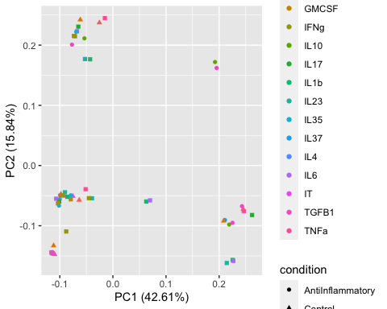
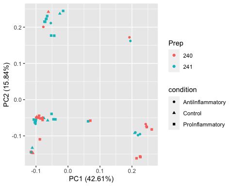
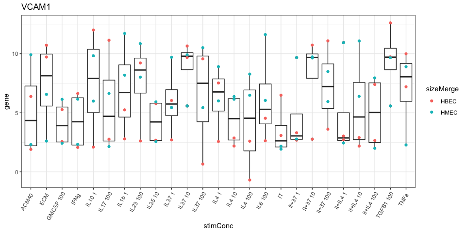
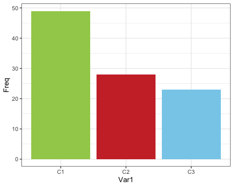
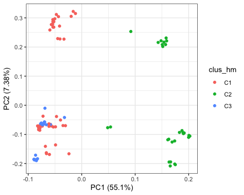
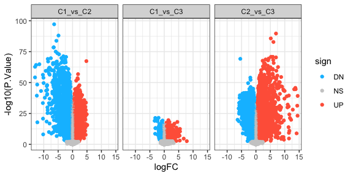
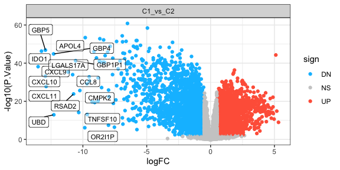

bulkseq endos analysis
================

This is an analysis performed on the bulk RNA-Seq dataset

The workflow is as follows:  
1. Inspect variance in the dataset (Filtering, Normalization, PCA)  
2. Perform differential expression analysis (Using limma)  
3. Annotate biological signatures found by DEA (GSEA)

### Counts list

``` r
dat = read.csv('/Users/skander/Library/CloudStorage/OneDrive-Personnel/Documents/UDEM/Master/BulkData/data/Endo/mycountmatrix.csv',header = TRUE, sep = ";", row.names = 1 )
dat = subset(dat, select = -c(S91.1) )
knitr::kable(dat[1:10, 1:12], caption ="A Knitr kable")
```

|                 |     S114 |    S115 |    S116 |    S117 |    S118 |    S121 |    S122 |    S123 |    S124 |     S125 |     S126 |     S127 |
|:----------------|---------:|--------:|--------:|--------:|--------:|--------:|--------:|--------:|--------:|---------:|---------:|---------:|
| ENSG00000000003 |   164.00 |  222.00 |  218.00 |  215.00 |  258.00 |  285.00 |  306.00 |  261.00 |  289.00 |    98.00 |   102.00 |    74.00 |
| ENSG00000000005 |     2.00 |    4.00 |    1.00 |    0.00 |    0.00 |    0.00 |    0.00 |    1.00 |    2.00 |     1.00 |     0.00 |     0.00 |
| ENSG00000000419 |   499.00 |  564.00 |  543.00 |  589.00 |  561.00 |  726.00 |  683.00 |  689.00 |  688.00 |   391.00 |   349.00 |   276.00 |
| ENSG00000000457 |   470.95 |  171.49 |  174.21 |  188.85 |  126.95 |  152.31 |  189.14 |  184.29 |  175.25 |   667.27 |   583.16 |   526.56 |
| ENSG00000000460 |    68.05 |  158.51 |  153.79 |  141.15 |  306.05 |  357.69 |  294.86 |  303.71 |  300.75 |    56.73 |    47.84 |    37.44 |
| ENSG00000000938 |     1.00 |    1.00 |    0.00 |    2.00 |    0.00 |    0.00 |    0.00 |    0.00 |    1.00 |     4.00 |     0.00 |     0.00 |
| ENSG00000000971 | 32098.85 | 6987.76 | 7215.98 | 7405.73 | 3545.06 | 3412.99 | 2802.98 | 3201.92 | 3255.76 | 20662.66 | 17773.85 | 14512.06 |
| ENSG00000001036 |   893.02 | 1030.37 |  974.90 | 1052.08 |  974.84 |  848.96 |  836.29 |  864.86 |  797.46 |   615.99 |   576.29 |   448.47 |
| ENSG00000001084 |   635.00 |  807.00 |  881.00 |  822.00 |  520.00 |  324.00 |  331.00 |  387.00 |  316.00 |   365.00 |   342.00 |   296.00 |
| ENSG00000001167 |   404.00 |  499.00 |  472.00 |  467.00 |  539.00 |  594.00 |  637.00 |  613.00 |  574.00 |   314.00 |   269.00 |   254.00 |

A Knitr kable

``` r
#length(colnames(dat))
```

### Meta data

``` r
meta = read.xlsx('/Users/skander/Library/CloudStorage/OneDrive-Personnel/Documents/UDEM/Master/BulkData/data/Endo/20220721_Metadata_bulkseq_endos_run1.xlsx')
rownames(meta) <- paste0("S",meta$New.tube.label,sep = "")
meta$RNA.iso.date <- as.Date(meta$RNA.iso.date, origin="1900-01-01")
meta$RNA.iso.date <- factor(meta$RNA.iso.date)
meta$Prep <- factor(meta$Prep)
names(meta)[names(meta) == "Proj.3(Cyto)"] <- "proj.Cyto"
names(meta)[names(meta) == "Proj1(37)"] <- "proj.IL37"
names(meta)[names(meta) == "Proj2(IL4)"] <- "proj.IL4"
names(meta)[names(meta) == "Flowcell#"] <- "Flowcell"
meta$proj.Cyto[2]="Cyto"
meta$proj.Cyto[5]="Cyto"
meta$stim[8]="IL1b"

meta$stim=gsub("40% ACM","ACM40",meta$stim)
meta$condition <- "NA"
meta$stimConc = "NA"
for(i in 1:nrow(meta)){
    if(meta$stim[i]=="IL23"|meta$stim[i]=="IL1b"|meta$stim[i]=="TNFa"|meta$stim[i]=="IFNg"|meta$stim[i]=="IL6"|meta$stim[i]=="IL17"|meta$stim[i]=="GMCSF"){
        meta$condition[i] <- "ProInflammatory"
    }
    else if(meta$stim[i]=="IL35"|meta$stim[i]=="IL10"|meta$stim[i]=="TGFB1"|meta$stim[i]=="IL37"|meta$stim[i]=="IL4"){
        meta$condition[i]<-"AntiInflammatory"
    }
    else if(meta$stim[i]=="IT"|meta$stim[i]=="ECM"|meta$stim[i]=="ACM40"){
        meta$condition[i]<-"Control"
    }
    else{
        meta$condition[i]<-"ControlAntiInflammtory"
    }
}

#for(i in 1:nrow(meta)){
#    if(rownames(meta)[i]=="S109"){
#        meta$test[i] <- "109"
#    }
#    else if(rownames(meta)[i]=="S110"){
#        meta$test[i] <- "110"
#    }
#    else if(rownames(meta)[i]=="S111"){
#        meta$test[i] <- "111"
#    }
#    else if(rownames(meta)[i]=="S197"){
#        meta$test[i] <- "197"
#    }
#    else if(rownames(meta)[i]=="S198"){
#        meta$test[i] <- "198"
#    } 
#    else if(rownames(meta)[i]=="S199"){
#        meta$test[i] <- "199"
#    }
#    else{
#        meta$test[i] <- "other"
#    }
#} 
    
meta <- meta %>% dplyr::select(Prep,size,p,stim,condition, everything())   
genomic_idx <- match(rownames(meta), colnames(dat))
dat  <- dat[ , genomic_idx]
meta$sizeMerge = "NA"
for(i in 1:nrow(meta)){
    if(meta$size[i]==">30"|meta$size[i]=="<30"){
        meta$sizeMerge[i] <- "HMEC"
    }
    else{
        meta$sizeMerge[i] <- "HBEC"
    }
}


knitr::kable(meta[,1:11], caption ="A Knitr kable")
```

|      | Prep | size |   p | stim   | condition              | proj.IL37 | proj.IL4 | proj.Cyto | Flowcell  | conc     | Run.# |
|:-----|:-----|:-----|----:|:-------|:-----------------------|:----------|:---------|:----------|:----------|:---------|------:|
| S91  | 241  | 112  |   3 | IL37   | AntiInflammatory       | IL37      | NA       | NA        | HFFTKBGXM | 1ng/ml   |     4 |
| S92  | 241  | 112  |   3 | IL37   | AntiInflammatory       | IL37      | NA       | Cyto      | HFFTKBGXM | 10ng/ml  |     4 |
| S93  | 241  | 112  |   3 | IL37   | AntiInflammatory       | IL37      | NA       | NA        | HFFTKBGXM | 100ng/ml |     4 |
| S94  | 241  | 112  |   3 | IL4    | AntiInflammatory       | NA        | IL4      | NA        | HFFTKBGXM | 1ng/ml   |     4 |
| S95  | 241  | 112  |   3 | IL4    | AntiInflammatory       | NA        | IL4      | Cyto      | HFFTKBGXM | 10ng/ml  |     4 |
| S96  | 241  | 112  |   3 | IL4    | AntiInflammatory       | NA        | IL4      | NA        | HFFTKBGXM | 100ng/ml |     4 |
| S97  | 241  | 112  |   3 | IL23   | ProInflammatory        | NA        | NA       | Cyto      | HFFTKBGXM | 100ng/ml |     5 |
| S98  | 241  | 112  |   3 | IL1b   | ProInflammatory        | NA        | NA       | Cyto      | HFFTKBGXM | 1ng/ml   |     5 |
| S99  | 241  | 112  |   3 | IL6    | ProInflammatory        | NA        | NA       | Cyto      | HFFTKBGXM | 100ng/ml |     5 |
| S100 | 241  | 112  |   3 | it+37  | ControlAntiInflammtory | IL37      | NA       | NA        | HFFTKBGXM | 1ng/ml   |     5 |
| S101 | 241  | 112  |   3 | it+37  | ControlAntiInflammtory | IL37      | NA       | NA        | HFFTKBGXM | 10ng/ml  |     5 |
| S102 | 241  | 112  |   3 | it+37  | ControlAntiInflammtory | IL37      | NA       | NA        | HFFTKBGXM | 100ng/ml |     5 |
| S103 | 241  | 112  |   3 | it+IL4 | ControlAntiInflammtory | NA        | IL4      | NA        | HFFTKBGXM | 1ng/ml   |     5 |
| S104 | 241  | 112  |   3 | it+IL4 | ControlAntiInflammtory | NA        | IL4      | NA        | HFFTKBGXM | 10ng/ml  |     5 |
| S105 | 241  | 112  |   3 | it+IL4 | ControlAntiInflammtory | NA        | IL4      | NA        | HFFTKBGXM | 100ng/ml |     5 |
| S106 | 241  | 112  |   3 | IL10   | AntiInflammatory       | NA        | NA       | Cyto      | HFFTKBGXM | 1ng/ml   |     5 |
| S107 | 241  | 112  |   3 | TGFB1  | AntiInflammatory       | NA        | NA       | Cyto      | HFFTKBGXM | 100ng/ml |     5 |
| S109 | 241  | 112  |   3 | IL17   | ProInflammatory        | NA        | NA       | Cyto      | HFFTKBGXM | 100ng/ml |     5 |
| S110 | 241  | 112  |   3 | GMCSF  | ProInflammatory        | NA        | NA       | Cyto      | HFFTKBGXM | 100ng/ml |     5 |
| S111 | 241  | 112  |   3 | IL35   | AntiInflammatory       | NA        | NA       | Cyto      | HFFTKBGXM | 10ng/ml  |     5 |
| S114 | 241  | 112  |   3 | ECM    | Control                | IL37      | IL4      | Cyto      | H2V22BGXM | NA       |     5 |
| S115 | 241  | 112  |   3 | ACM40  | Control                | IL37      | IL4      | Cyto      | H2V22BGXM | NA       |     5 |
| S116 | 241  | 112  |   3 | IT     | Control                | IL37      | IL4      | Cyto      | H2V22BGXM | NA       |     5 |
| S117 | 241  | 112  |   3 | IFNg   | ProInflammatory        | NA        | NA       | Cyto      | H2V22BGXM | NA       |     5 |
| S118 | 241  | 112  |   3 | TNFa   | ProInflammatory        | NA        | NA       | Cyto      | H2V22BGXM | NA       |     5 |
| S121 | 240  | 112  |   3 | it+IL4 | ControlAntiInflammtory | NA        | IL4      | NA        | H2V22BGXM | 1ng/ml   |     6 |
| S122 | 240  | 112  |   3 | it+IL4 | ControlAntiInflammtory | NA        | IL4      | NA        | H2V22BGXM | 10ng/ml  |     6 |
| S123 | 240  | 112  |   3 | it+IL4 | ControlAntiInflammtory | NA        | IL4      | NA        | H2V22BGXM | 100ng/ml |     6 |
| S124 | 240  | 112  |   3 | it+37  | ControlAntiInflammtory | IL37      | NA       | NA        | H2V22BGXM | 1ng/ml   |     6 |
| S125 | 240  | 112  |   3 | it+37  | ControlAntiInflammtory | IL37      | NA       | NA        | H2V22BGXM | 10ng/ml  |     6 |
| S126 | 240  | 112  |   3 | it+37  | ControlAntiInflammtory | IL37      | NA       | NA        | H2V22BGXM | 100ng/ml |     6 |
| S127 | 240  | 112  |   3 | IL17   | ProInflammatory        | NA        | NA       | Cyto      | H2V22BGXM | 100ng/ml |     6 |
| S128 | 240  | 112  |   3 | GMCSF  | ProInflammatory        | NA        | NA       | Cyto      | H2V22BGXM | 100ng/ml |     6 |
| S129 | 240  | 112  |   3 | IL35   | AntiInflammatory       | NA        | NA       | Cyto      | H2V22BGXM | 10ng/ml  |     6 |
| S130 | 240  | 112  |   3 | IL37   | AntiInflammatory       | IL37      | NA       | NA        | H2V22BGXM | 1ng/ml   |     6 |
| S131 | 240  | 112  |   3 | IL37   | AntiInflammatory       | IL37      | NA       | NA        | H2V22BGXM | 10ng/ml  |     6 |
| S132 | 240  | 112  |   3 | IL37   | AntiInflammatory       | IL37      | NA       | NA        | H2V22BGXM | 100ng/ml |     6 |
| S133 | 240  | 112  |   3 | ECM    | Control                | IL37      | IL4      | Cyto      | H2V22BGXM | NA       |     6 |
| S134 | 240  | 112  |   3 | IT     | Control                | IL37      | IL4      | Cyto      | H2V22BGXM | NA       |     6 |
| S135 | 240  | 112  |   3 | IL23   | ProInflammatory        | NA        | NA       | Cyto      | H2V22BGXM | 100ng/ml |     6 |
| S136 | 240  | 112  |   3 | IL1b   | ProInflammatory        | NA        | NA       | Cyto      | HFF7HBGXM | 1ng/ml   |     6 |
| S137 | 240  | 112  |   3 | IL6    | ProInflammatory        | NA        | NA       | Cyto      | HFF7HBGXM | 100ng/ml |     6 |
| S138 | 240  | 112  |   3 | IL4    | AntiInflammatory       | NA        | IL4      | NA        | HFF7HBGXM | 1ng/ml   |     6 |
| S139 | 240  | 112  |   3 | IL4    | AntiInflammatory       | NA        | IL4      | NA        | HFF7HBGXM | 10ng/ml  |     6 |
| S140 | 240  | 112  |   3 | IL4    | AntiInflammatory       | NA        | IL4      | NA        | HFF7HBGXM | 100ng/ml |     6 |
| S141 | 240  | 112  |   3 | IL10   | AntiInflammatory       | NA        | NA       | Cyto      | HFF7HBGXM | 1ng/ml   |     6 |
| S142 | 240  | 112  |   3 | TGFB1  | AntiInflammatory       | NA        | NA       | Cyto      | HFF7HBGXM | 100ng/ml |     6 |
| S146 | 240  | 112  |   3 | ACM40  | Control                | IL37      | IL4      | Cyto      | HFF7HBGXM | NA       |     7 |
| S147 | 240  | 112  |   3 | IFNg   | ProInflammatory        | NA        | NA       | Cyto      | HFF7HBGXM | NA       |     7 |
| S148 | 240  | 112  |   3 | TNFa   | ProInflammatory        | NA        | NA       | Cyto      | HFF7HBGXM | NA       |     7 |
| S150 | 241  | \<30 |   3 | IL10   | AntiInflammatory       | NA        | NA       | Cyto      | HFF7HBGXM | 1ng/ml   |     7 |
| S151 | 241  | \<30 |   3 | TGFB1  | AntiInflammatory       | NA        | NA       | Cyto      | HFF7HBGXM | 100ng/ml |     7 |
| S152 | 241  | \<30 |   3 | IL37   | AntiInflammatory       | IL37      | NA       | NA        | HFF7HBGXM | 1ng/ml   |     7 |
| S153 | 241  | \<30 |   3 | IL37   | AntiInflammatory       | IL37      | NA       | NA        | HFF7HBGXM | 10ng/ml  |     7 |
| S154 | 241  | \<30 |   3 | IL37   | AntiInflammatory       | IL37      | NA       | NA        | HFF7HBGXM | 100ng/ml |     7 |
| S155 | 241  | \<30 |   3 | it+IL4 | ControlAntiInflammtory | NA        | IL4      | NA        | HFF7HBGXM | 1ng/ml   |     7 |
| S156 | 241  | \<30 |   3 | it+IL4 | ControlAntiInflammtory | NA        | IL4      | NA        | HFF7HBGXM | 10ng/ml  |     7 |
| S157 | 241  | \<30 |   3 | it+IL4 | ControlAntiInflammtory | NA        | IL4      | NA        | HFF7HBGXM | 100ng/ml |     7 |
| S158 | 241  | \<30 |   3 | IL23   | ProInflammatory        | NA        | NA       | Cyto      | HFF7HBGXM | 100ng/ml |     7 |
| S159 | 241  | \<30 |   3 | IL1b   | ProInflammatory        | NA        | NA       | Cyto      | HFF7HBGXM | 1ng/ml   |     7 |
| S160 | 241  | \<30 |   3 | IL6    | ProInflammatory        | NA        | NA       | Cyto      | HFGNNBGXM | 100ng/ml |     7 |
| S161 | 241  | \<30 |   3 | IL17   | ProInflammatory        | NA        | NA       | Cyto      | HFGNNBGXM | 100ng/ml |     7 |
| S162 | 241  | \<30 |   3 | GMCSF  | ProInflammatory        | NA        | NA       | Cyto      | HFGNNBGXM | 100ng/ml |     7 |
| S163 | 241  | \<30 |   3 | IL35   | AntiInflammatory       | NA        | NA       | Cyto      | HFGNNBGXM | 10ng/ml  |     7 |
| S164 | 241  | \<30 |   3 | it+37  | ControlAntiInflammtory | IL37      | NA       | NA        | HFGNNBGXM | 1ng/ml   |     7 |
| S165 | 241  | \<30 |   3 | it+37  | ControlAntiInflammtory | IL37      | NA       | NA        | HFGNNBGXM | 10ng/ml  |     7 |
| S166 | 241  | \<30 |   3 | it+37  | ControlAntiInflammtory | IL37      | NA       | NA        | HFGNNBGXM | 100ng/ml |     7 |
| S167 | 241  | \<30 |   3 | IL4    | AntiInflammatory       | NA        | IL4      | NA        | HFGNNBGXM | 1ng/ml   |     7 |
| S168 | 241  | \<30 |   3 | IL4    | AntiInflammatory       | NA        | IL4      | NA        | HFGNNBGXM | 10ng/ml  |     7 |
| S169 | 241  | \<30 |   3 | IL4    | AntiInflammatory       | NA        | IL4      | NA        | HFGNNBGXM | 100ng/ml |     8 |
| S170 | 241  | \<30 |   3 | ACM40  | Control                | IL37      | IL4      | Cyto      | HFGNNBGXM | NA       |     8 |
| S171 | 241  | \<30 |   3 | IFNg   | ProInflammatory        | NA        | NA       | Cyto      | HFGNNBGXM | NA       |     8 |
| S172 | 241  | \<30 |   3 | TNFa   | ProInflammatory        | NA        | NA       | Cyto      | HFGNNBGXM | NA       |     8 |
| S173 | 240  | \>30 |   3 | IL4    | AntiInflammatory       | NA        | IL4      | NA        | HFGNNBGXM | 1ng/ml   |     8 |
| S174 | 240  | \>30 |   3 | IL4    | AntiInflammatory       | NA        | IL4      | NA        | HFGNNBGXM | 10ng/ml  |     8 |
| S175 | 240  | \>30 |   3 | IL4    | AntiInflammatory       | NA        | IL4      | NA        | HFGNNBGXM | 100ng/ml |     8 |
| S176 | 240  | \>30 |   3 | IL10   | AntiInflammatory       | NA        | NA       | Cyto      | HFGNNBGXM | 1ng/ml   |     8 |
| S177 | 240  | \>30 |   3 | TGFB1  | AntiInflammatory       | NA        | NA       | Cyto      | HFGNNBGXM | 100ng/ml |     8 |
| S178 | 240  | \>30 |   3 | ECM    | Control                | IL37      | IL4      | Cyto      | HFGNNBGXM | NA       |     8 |
| S179 | 240  | \>30 |   3 | IL17   | ProInflammatory        | NA        | NA       | Cyto      | HFGNNBGXM | 100ng/ml |     8 |
| S180 | 240  | \>30 |   3 | GMCSF  | ProInflammatory        | NA        | NA       | Cyto      | HFGNTBGXM | 100ng/ml |     8 |
| S181 | 240  | \>30 |   3 | IL35   | AntiInflammatory       | NA        | NA       | Cyto      | HFGNTBGXM | 10ng/ml  |     8 |
| S182 | 240  | \>30 |   3 | IL37   | AntiInflammatory       | IL37      | NA       | NA        | HFGNTBGXM | 1ng/ml   |     8 |
| S183 | 240  | \>30 |   3 | IL37   | AntiInflammatory       | IL37      | NA       | NA        | HFGNTBGXM | 10ng/ml  |     8 |
| S184 | 240  | \>30 |   3 | IL37   | AntiInflammatory       | IL37      | NA       | NA        | HFGNTBGXM | 100ng/ml |     8 |
| S185 | 240  | \>30 |   3 | it+IL4 | ControlAntiInflammtory | NA        | IL4      | NA        | HFGNTBGXM | 1ng/ml   |     8 |
| S186 | 240  | \>30 |   3 | it+IL4 | ControlAntiInflammtory | NA        | IL4      | NA        | HFGNTBGXM | 10ng/ml  |     8 |
| S187 | 240  | \>30 |   3 | it+IL4 | ControlAntiInflammtory | NA        | IL4      | NA        | HFGNTBGXM | 100ng/ml |     8 |
| S188 | 240  | \>30 |   3 | it+37  | ControlAntiInflammtory | IL37      | NA       | NA        | HFGNTBGXM | 1ng/ml   |     8 |
| S189 | 240  | \>30 |   3 | it+37  | ControlAntiInflammtory | IL37      | NA       | NA        | HFGNTBGXM | 10ng/ml  |     8 |
| S190 | 240  | \>30 |   3 | it+37  | ControlAntiInflammtory | IL37      | NA       | NA        | HFGNTBGXM | 100ng/ml |     8 |
| S191 | 240  | \>30 |   3 | IL23   | ProInflammatory        | NA        | NA       | Cyto      | HFGNTBGXM | 100ng/ml |     8 |
| S192 | 240  | \>30 |   3 | IL1b   | ProInflammatory        | NA        | NA       | Cyto      | HFGNTBGXM | 1ng/ml   |     8 |
| S193 | 240  | \>30 |   3 | IL6    | ProInflammatory        | NA        | NA       | Cyto      | HFGNTBGXM | 100ng/ml |     9 |
| S194 | 240  | \>30 |   3 | IT     | Control                | IL37      | IL4      | Cyto      | HFGNTBGXM | NA       |     9 |
| S195 | 240  | \>30 |   3 | IFNg   | ProInflammatory        | NA        | NA       | Cyto      | HFGNTBGXM | NA       |     9 |
| S196 | 240  | \>30 |   3 | TNFa   | ProInflammatory        | NA        | NA       | Cyto      | HFGNTBGXM | NA       |     9 |
| S197 | 240  | \>30 |   3 | ACM40  | Control                | IL37      | IL4      | Cyto      | HFGNTBGXM | NA       |     9 |
| S198 | 241  | \<30 |   3 | IT     | Control                | IL37      | IL4      | Cyto      | HFGNTBGXM | NA       |     9 |
| S199 | 241  | \<30 |   3 | ECM    | Control                | IL37      | IL4      | Cyto      | HFGNTBGXM | NA       |     9 |

A Knitr kable

``` r
metaF = read.xlsx('/Users/skander/Library/CloudStorage/OneDrive-Personnel/Documents/UDEM/Master/BulkData/data/Endo/20220815_Overview_bulkseq_endo_cytokines_FIXED_v1.xlsx')
rownames(metaF) <- paste0("S",metaF$New.tube.label,sep = "") 
names(metaF)[names(metaF) == "Flowcell#"] <- "Flowcell"
genomic_idx <- match(rownames(meta), colnames(dat))
dat  <- dat[ , genomic_idx]
metaF$Cytokine <- gsub("TGFB1","TGFb1",metaF$Cytokine)
metaF$Cytokine <- gsub("TGFB","TGFb1",metaF$Cytokine)
metaF$Cytokine <- gsub("IL1B","IL1b",metaF$Cytokine)
#knitr::kable(metaF, caption ="A Knitr kable")

sign_cols=c(DN='deepskyblue',NS='grey80',UP='tomato')
go = read.gmt('/Users/skander/Library/CloudStorage/OneDrive-Personnel/Documents/UDEM/Master/BulkData/GO/c5.go.bp.v7.5.1.symbols.gmt')
mf = read.gmt('/Users/skander/Library/CloudStorage/OneDrive-Personnel/Documents/UDEM/Master/BulkData/GO/c5.go.mf.v7.5.1.symbols.gmt')
kegg = read.gmt('/Users/skander/Library/CloudStorage/OneDrive-Personnel/Documents/UDEM/Master/BulkData/GO/c2.cp.kegg.v7.5.1.symbols.gmt')
tft = read.gmt('/Users/skander/Library/CloudStorage/OneDrive-Personnel/Documents/UDEM/Master/BulkData/GO/c3.tft.v7.5.1.symbols.gmt')
## Differential expression analysis with limma-voom

### Filtering to remove lowly expressed genes + Normalization for composition bias

d0 <- DGEList(dat)
d0 <- calcNormFactors(d0)
cutoff <- 2
drop <- which(apply(cpm(d0), 1, max) < cutoff)
d <- d0[-drop,]


mmF <- model.matrix(~ 0 + Cytokine, data=metaF[colnames(d),])
yF <- voom(d, mmF, plot = F)
```

## Differential expression analysis with limma-voom

### Filtering to remove lowly expressed genes + Normalization for composition bias

use the *edgeR/limma* workflow to filter out lowly expressed genes.
*Voom* is used to normalize the raw counts. A linear mixed model is used
to fit the expression values. Defining the model is done with the
model.matrix function of edgeR. In the model are included factors of
interest (group). If a batch/patient effect is detected, it can be added
to the model to account for its effect.

``` r
d0 <- DGEList(dat)
d0 <- calcNormFactors(d0)
cutoff <- 2
drop <- which(apply(cpm(d0), 1, max) < cutoff)
d <- d0[-drop,]


mm <- model.matrix(~ 0 + stim + Flowcell , data=meta[colnames(d),])

# Without filtering low expressed genes
y <- voom(d0, mm, plot = T)
```

<!-- -->

``` r
# Filtering low expressed genes
y <- voom(d, mm, plot = T)
```

<!-- -->

``` r
##gene name reference(ref_G)
conv_B=AnnotationDbi::select(org.Hs.eg.db,keys=rownames(y$E),keytype='ENSEMBL',columns=c('GENENAME','SYMBOL'))
```

    ## 'select()' returned 1:many mapping between keys and columns

``` r
ref_G=conv_B[!duplicated(conv_B[,1]),]
rownames(ref_G)=ref_G[,1]
##
```

## PCA

Perform a *PCA* on the normalized samples and identify main factors of
variation.

``` r
### PCA ALL PROJECT Version Modif
pcaF = prcomp(t(yF$E))
metaF=metaF[colnames(yF$E),]
metaF$PC1 = pcaF$x[,1]
metaF$PC2 = pcaF$x[,2]
meta=data.frame(meta)
autoplot(pcaF,data=meta,col="Flowcell",title ="flowcell")
```

<!-- -->

``` r
autoplot(pcaF,data=meta,col='size',title ="size",label = TRUE)
```

<!-- -->

``` r
autoplot(pcaF,data=meta,col='stim',title ="stim")
```

<!-- -->

``` r
### PCA ALL PROJECT First Version
pca = prcomp(t(y$E))
meta=meta[colnames(y$E),]
meta$PC1 = pca$x[,1]
meta$PC2 = pca$x[,2]
meta=data.frame(meta)
#autoplot(pca,data=meta,col='test',title ="condition", label = TRUE, label.size = 5)
autoplot(pca,data=meta,col='condition',title ="condition")
```

<!-- -->

``` r
autoplot(pca,data=meta,col="Flowcell",shape="condition",title ="flowcell")
```

<!-- -->

``` r
autoplot(pca,data=meta,col='RNA.iso.date',shape="condition",title ="RNA.iso.date")
```

<!-- -->

``` r
autoplot(pca,data=meta,col='size',shape="condition",title ="size",label = TRUE)
```

<!-- -->

``` r
autoplot(pca,data=meta,col='sizeMerge',shape="size",title ="size")
```

<!-- -->

``` r
autoplot(pca,data=meta,col='stim',shape="condition",title ="stim")
```

<!-- -->

``` r
autoplot(pca,data=meta,col='Prep',shape="condition",title ="Prep")
```

<!-- -->

``` r
#BDCorrB <- removeBatchEffect(y$E,batch = meta$Flowcell)
#BD1B <- prcomp(t(BDCorrB))
#autoplot(BD1B,data=meta,col="Flowcell",title ="flowcell")

BDCorrB <- removeBatchEffect(y$E,batch = meta$Flowcell)
BD1B <- pca(BDCorrB, metadata = meta)
biplot(BD1B, colby = 'size',shape = 'condition', hline = 0, vline = 0,legendPosition = 'right', lab="",title="size")
```

<!-- -->

``` r
biplot(BD1B, colby = 'sizeMerge',shape = 'condition', hline = 0, vline = 0,legendPosition = 'right', lab="",title="sizeMerge")
```

<!-- -->

``` r
meta$showPCA=paste(meta$New.tube.label,meta$stim,sep="-")
library(autoplotly)
autoplotly(pca,data=meta,col='sizeMerge',fill="showPCA",shape="size",title ="size")
```

<div id="htmlwidget-a69b7814fffa7e73e38d" style="width:864px;height:768px;" class="plotly html-widget"></div>
<script type="application/json" data-for="htmlwidget-a69b7814fffa7e73e38d">{"x":{"data":[{"x":[-0.0780122788654503],"y":[-0.0480474160155893],"text":"PC1: -0.07801228<br />PC2: -0.048047416<br />sizeMerge: HBEC<br />showPCA: 100-it+37<br />size: 112","type":"scatter","mode":"markers","marker":{"autocolorscale":false,"color":"rgba(248,118,109,1)","opacity":1,"size":5.66929133858268,"symbol":"square","line":{"width":1.88976377952756,"color":"rgba(248,118,109,1)"}},"hoveron":"points","name":"(HBEC,100-it+37,112)","legendgroup":"(HBEC,100-it+37,112)","showlegend":true,"xaxis":"x","yaxis":"y","hoverinfo":"text","frame":null},{"x":[-0.0767254114885589],"y":[-0.0440939159645244],"text":"PC1: -0.07672541<br />PC2: -0.044093916<br />sizeMerge: HBEC<br />showPCA: 101-it+37<br />size: 112","type":"scatter","mode":"markers","marker":{"autocolorscale":false,"color":"rgba(246,121,99,1)","opacity":1,"size":5.66929133858268,"symbol":"square","line":{"width":1.88976377952756,"color":"rgba(248,118,109,1)"}},"hoveron":"points","name":"(HBEC,101-it+37,112)","legendgroup":"(HBEC,101-it+37,112)","showlegend":true,"xaxis":"x","yaxis":"y","hoverinfo":"text","frame":null},{"x":[-0.0758672354031359],"y":[-0.0450183759104122],"text":"PC1: -0.07586724<br />PC2: -0.045018376<br />sizeMerge: HBEC<br />showPCA: 102-it+37<br />size: 112","type":"scatter","mode":"markers","marker":{"autocolorscale":false,"color":"rgba(243,123,89,1)","opacity":1,"size":5.66929133858268,"symbol":"square","line":{"width":1.88976377952756,"color":"rgba(248,118,109,1)"}},"hoveron":"points","name":"(HBEC,102-it+37,112)","legendgroup":"(HBEC,102-it+37,112)","showlegend":true,"xaxis":"x","yaxis":"y","hoverinfo":"text","frame":null},{"x":[-0.0777955633943483],"y":[-0.0445410969304188],"text":"PC1: -0.07779556<br />PC2: -0.044541097<br />sizeMerge: HBEC<br />showPCA: 103-it+IL4<br />size: 112","type":"scatter","mode":"markers","marker":{"autocolorscale":false,"color":"rgba(240,126,77,1)","opacity":1,"size":5.66929133858268,"symbol":"square","line":{"width":1.88976377952756,"color":"rgba(248,118,109,1)"}},"hoveron":"points","name":"(HBEC,103-it+IL4,112)","legendgroup":"(HBEC,103-it+IL4,112)","showlegend":true,"xaxis":"x","yaxis":"y","hoverinfo":"text","frame":null},{"x":[-0.0773169762157295],"y":[-0.043285243048554],"text":"PC1: -0.07731698<br />PC2: -0.043285243<br />sizeMerge: HBEC<br />showPCA: 104-it+IL4<br />size: 112","type":"scatter","mode":"markers","marker":{"autocolorscale":false,"color":"rgba(237,129,65,1)","opacity":1,"size":5.66929133858268,"symbol":"square","line":{"width":1.88976377952756,"color":"rgba(248,118,109,1)"}},"hoveron":"points","name":"(HBEC,104-it+IL4,112)","legendgroup":"(HBEC,104-it+IL4,112)","showlegend":true,"xaxis":"x","yaxis":"y","hoverinfo":"text","frame":null},{"x":[-0.0455809394423818],"y":[-0.0220886215265583],"text":"PC1: -0.04558094<br />PC2: -0.022088622<br />sizeMerge: HBEC<br />showPCA: 105-it+IL4<br />size: 112","type":"scatter","mode":"markers","marker":{"autocolorscale":false,"color":"rgba(234,131,49,1)","opacity":1,"size":5.66929133858268,"symbol":"square","line":{"width":1.88976377952756,"color":"rgba(248,118,109,1)"}},"hoveron":"points","name":"(HBEC,105-it+IL4,112)","legendgroup":"(HBEC,105-it+IL4,112)","showlegend":true,"xaxis":"x","yaxis":"y","hoverinfo":"text","frame":null},{"x":[0.163683003414925],"y":[-0.0722670795662351],"text":"PC1:  0.16368300<br />PC2: -0.072267080<br />sizeMerge: HBEC<br />showPCA: 106-IL10<br />size: 112","type":"scatter","mode":"markers","marker":{"autocolorscale":false,"color":"rgba(231,134,27,1)","opacity":1,"size":5.66929133858268,"symbol":"square","line":{"width":1.88976377952756,"color":"rgba(248,118,109,1)"}},"hoveron":"points","name":"(HBEC,106-IL10,112)","legendgroup":"(HBEC,106-IL10,112)","showlegend":true,"xaxis":"x","yaxis":"y","hoverinfo":"text","frame":null},{"x":[0.168314350310316],"y":[-0.0701302712858887],"text":"PC1:  0.16831435<br />PC2: -0.070130271<br />sizeMerge: HBEC<br />showPCA: 107-TGFB1<br />size: 112","type":"scatter","mode":"markers","marker":{"autocolorscale":false,"color":"rgba(227,136,0,1)","opacity":1,"size":5.66929133858268,"symbol":"square","line":{"width":1.88976377952756,"color":"rgba(248,118,109,1)"}},"hoveron":"points","name":"(HBEC,107-TGFB1,112)","legendgroup":"(HBEC,107-TGFB1,112)","showlegend":true,"xaxis":"x","yaxis":"y","hoverinfo":"text","frame":null},{"x":[-0.0756129456763209],"y":[-0.044201233094891],"text":"PC1: -0.07561295<br />PC2: -0.044201233<br />sizeMerge: HBEC<br />showPCA: 109-IL17<br />size: 112","type":"scatter","mode":"markers","marker":{"autocolorscale":false,"color":"rgba(224,139,0,1)","opacity":1,"size":5.66929133858268,"symbol":"square","line":{"width":1.88976377952756,"color":"rgba(248,118,109,1)"}},"hoveron":"points","name":"(HBEC,109-IL17,112)","legendgroup":"(HBEC,109-IL17,112)","showlegend":true,"xaxis":"x","yaxis":"y","hoverinfo":"text","frame":null},{"x":[-0.0774093184589158],"y":[-0.0462434485738201],"text":"PC1: -0.07740932<br />PC2: -0.046243449<br />sizeMerge: HBEC<br />showPCA: 110-GMCSF<br />size: 112","type":"scatter","mode":"markers","marker":{"autocolorscale":false,"color":"rgba(220,141,0,1)","opacity":1,"size":5.66929133858268,"symbol":"square","line":{"width":1.88976377952756,"color":"rgba(248,118,109,1)"}},"hoveron":"points","name":"(HBEC,110-GMCSF,112)","legendgroup":"(HBEC,110-GMCSF,112)","showlegend":true,"xaxis":"x","yaxis":"y","hoverinfo":"text","frame":null},{"x":[-0.0758661647662348],"y":[-0.0491142952073711],"text":"PC1: -0.07586616<br />PC2: -0.049114295<br />sizeMerge: HBEC<br />showPCA: 111-IL35<br />size: 112","type":"scatter","mode":"markers","marker":{"autocolorscale":false,"color":"rgba(216,144,0,1)","opacity":1,"size":5.66929133858268,"symbol":"square","line":{"width":1.88976377952756,"color":"rgba(248,118,109,1)"}},"hoveron":"points","name":"(HBEC,111-IL35,112)","legendgroup":"(HBEC,111-IL35,112)","showlegend":true,"xaxis":"x","yaxis":"y","hoverinfo":"text","frame":null},{"x":[0.155946564421431],"y":[-0.0678190580163286],"text":"PC1:  0.15594656<br />PC2: -0.067819058<br />sizeMerge: HBEC<br />showPCA: 114-ECM<br />size: 112","type":"scatter","mode":"markers","marker":{"autocolorscale":false,"color":"rgba(211,146,0,1)","opacity":1,"size":5.66929133858268,"symbol":"square","line":{"width":1.88976377952756,"color":"rgba(248,118,109,1)"}},"hoveron":"points","name":"(HBEC,114-ECM,112)","legendgroup":"(HBEC,114-ECM,112)","showlegend":true,"xaxis":"x","yaxis":"y","hoverinfo":"text","frame":null},{"x":[-0.0474518566993596],"y":[-0.042330183965577],"text":"PC1: -0.04745186<br />PC2: -0.042330184<br />sizeMerge: HBEC<br />showPCA: 115-ACM40<br />size: 112","type":"scatter","mode":"markers","marker":{"autocolorscale":false,"color":"rgba(207,148,0,1)","opacity":1,"size":5.66929133858268,"symbol":"square","line":{"width":1.88976377952756,"color":"rgba(248,118,109,1)"}},"hoveron":"points","name":"(HBEC,115-ACM40,112)","legendgroup":"(HBEC,115-ACM40,112)","showlegend":true,"xaxis":"x","yaxis":"y","hoverinfo":"text","frame":null},{"x":[-0.0564035509069213],"y":[-0.0375655086173941],"text":"PC1: -0.05640355<br />PC2: -0.037565509<br />sizeMerge: HBEC<br />showPCA: 116-IT<br />size: 112","type":"scatter","mode":"markers","marker":{"autocolorscale":false,"color":"rgba(202,151,0,1)","opacity":1,"size":5.66929133858268,"symbol":"square","line":{"width":1.88976377952756,"color":"rgba(248,118,109,1)"}},"hoveron":"points","name":"(HBEC,116-IT,112)","legendgroup":"(HBEC,116-IT,112)","showlegend":true,"xaxis":"x","yaxis":"y","hoverinfo":"text","frame":null},{"x":[-0.033831343098372],"y":[-0.0399157025200291],"text":"PC1: -0.03383134<br />PC2: -0.039915703<br />sizeMerge: HBEC<br />showPCA: 117-IFNg<br />size: 112","type":"scatter","mode":"markers","marker":{"autocolorscale":false,"color":"rgba(197,153,0,1)","opacity":1,"size":5.66929133858268,"symbol":"square","line":{"width":1.88976377952756,"color":"rgba(248,118,109,1)"}},"hoveron":"points","name":"(HBEC,117-IFNg,112)","legendgroup":"(HBEC,117-IFNg,112)","showlegend":true,"xaxis":"x","yaxis":"y","hoverinfo":"text","frame":null},{"x":[-0.038397708532411],"y":[-0.0289905376225993],"text":"PC1: -0.03839771<br />PC2: -0.028990538<br />sizeMerge: HBEC<br />showPCA: 118-TNFa<br />size: 112","type":"scatter","mode":"markers","marker":{"autocolorscale":false,"color":"rgba(192,155,0,1)","opacity":1,"size":5.66929133858268,"symbol":"square","line":{"width":1.88976377952756,"color":"rgba(248,118,109,1)"}},"hoveron":"points","name":"(HBEC,118-TNFa,112)","legendgroup":"(HBEC,118-TNFa,112)","showlegend":true,"xaxis":"x","yaxis":"y","hoverinfo":"text","frame":null},{"x":[-0.0592812495903528],"y":[-0.0374972915480616],"text":"PC1: -0.05928125<br />PC2: -0.037497292<br />sizeMerge: HBEC<br />showPCA: 121-it+IL4<br />size: 112","type":"scatter","mode":"markers","marker":{"autocolorscale":false,"color":"rgba(187,157,0,1)","opacity":1,"size":5.66929133858268,"symbol":"square","line":{"width":1.88976377952756,"color":"rgba(248,118,109,1)"}},"hoveron":"points","name":"(HBEC,121-it+IL4,112)","legendgroup":"(HBEC,121-it+IL4,112)","showlegend":true,"xaxis":"x","yaxis":"y","hoverinfo":"text","frame":null},{"x":[-0.070963012562567],"y":[-0.0386203005119631],"text":"PC1: -0.07096301<br />PC2: -0.038620301<br />sizeMerge: HBEC<br />showPCA: 122-it+IL4<br />size: 112","type":"scatter","mode":"markers","marker":{"autocolorscale":false,"color":"rgba(181,159,0,1)","opacity":1,"size":5.66929133858268,"symbol":"square","line":{"width":1.88976377952756,"color":"rgba(248,118,109,1)"}},"hoveron":"points","name":"(HBEC,122-it+IL4,112)","legendgroup":"(HBEC,122-it+IL4,112)","showlegend":true,"xaxis":"x","yaxis":"y","hoverinfo":"text","frame":null},{"x":[-0.0671948477505429],"y":[-0.0330318713967623],"text":"PC1: -0.06719485<br />PC2: -0.033031871<br />sizeMerge: HBEC<br />showPCA: 123-it+IL4<br />size: 112","type":"scatter","mode":"markers","marker":{"autocolorscale":false,"color":"rgba(175,161,0,1)","opacity":1,"size":5.66929133858268,"symbol":"square","line":{"width":1.88976377952756,"color":"rgba(248,118,109,1)"}},"hoveron":"points","name":"(HBEC,123-it+IL4,112)","legendgroup":"(HBEC,123-it+IL4,112)","showlegend":true,"xaxis":"x","yaxis":"y","hoverinfo":"text","frame":null},{"x":[-0.056586094255198],"y":[-0.0379139133485578],"text":"PC1: -0.05658609<br />PC2: -0.037913913<br />sizeMerge: HBEC<br />showPCA: 124-it+37<br />size: 112","type":"scatter","mode":"markers","marker":{"autocolorscale":false,"color":"rgba(169,163,0,1)","opacity":1,"size":5.66929133858268,"symbol":"square","line":{"width":1.88976377952756,"color":"rgba(248,118,109,1)"}},"hoveron":"points","name":"(HBEC,124-it+37,112)","legendgroup":"(HBEC,124-it+37,112)","showlegend":true,"xaxis":"x","yaxis":"y","hoverinfo":"text","frame":null},{"x":[0.194128382556702],"y":[-0.0592418601775894],"text":"PC1:  0.19412838<br />PC2: -0.059241860<br />sizeMerge: HBEC<br />showPCA: 125-it+37<br />size: 112","type":"scatter","mode":"markers","marker":{"autocolorscale":false,"color":"rgba(163,165,0,1)","opacity":1,"size":5.66929133858268,"symbol":"square","line":{"width":1.88976377952756,"color":"rgba(248,118,109,1)"}},"hoveron":"points","name":"(HBEC,125-it+37,112)","legendgroup":"(HBEC,125-it+37,112)","showlegend":true,"xaxis":"x","yaxis":"y","hoverinfo":"text","frame":null},{"x":[0.19356899996233],"y":[-0.0630636646389385],"text":"PC1:  0.19356900<br />PC2: -0.063063665<br />sizeMerge: HBEC<br />showPCA: 126-it+37<br />size: 112","type":"scatter","mode":"markers","marker":{"autocolorscale":false,"color":"rgba(156,167,0,1)","opacity":1,"size":5.66929133858268,"symbol":"square","line":{"width":1.88976377952756,"color":"rgba(248,118,109,1)"}},"hoveron":"points","name":"(HBEC,126-it+37,112)","legendgroup":"(HBEC,126-it+37,112)","showlegend":true,"xaxis":"x","yaxis":"y","hoverinfo":"text","frame":null},{"x":[0.195848142020603],"y":[-0.0606213242436807],"text":"PC1:  0.19584814<br />PC2: -0.060621324<br />sizeMerge: HBEC<br />showPCA: 127-IL17<br />size: 112","type":"scatter","mode":"markers","marker":{"autocolorscale":false,"color":"rgba(149,169,0,1)","opacity":1,"size":5.66929133858268,"symbol":"square","line":{"width":1.88976377952756,"color":"rgba(248,118,109,1)"}},"hoveron":"points","name":"(HBEC,127-IL17,112)","legendgroup":"(HBEC,127-IL17,112)","showlegend":true,"xaxis":"x","yaxis":"y","hoverinfo":"text","frame":null},{"x":[-0.0592706824842257],"y":[-0.0413827389598604],"text":"PC1: -0.05927068<br />PC2: -0.041382739<br />sizeMerge: HBEC<br />showPCA: 128-GMCSF<br />size: 112","type":"scatter","mode":"markers","marker":{"autocolorscale":false,"color":"rgba(141,171,0,1)","opacity":1,"size":5.66929133858268,"symbol":"square","line":{"width":1.88976377952756,"color":"rgba(248,118,109,1)"}},"hoveron":"points","name":"(HBEC,128-GMCSF,112)","legendgroup":"(HBEC,128-GMCSF,112)","showlegend":true,"xaxis":"x","yaxis":"y","hoverinfo":"text","frame":null},{"x":[-0.0593376914664071],"y":[-0.036471591933406],"text":"PC1: -0.05933769<br />PC2: -0.036471592<br />sizeMerge: HBEC<br />showPCA: 129-IL35<br />size: 112","type":"scatter","mode":"markers","marker":{"autocolorscale":false,"color":"rgba(133,173,0,1)","opacity":1,"size":5.66929133858268,"symbol":"square","line":{"width":1.88976377952756,"color":"rgba(248,118,109,1)"}},"hoveron":"points","name":"(HBEC,129-IL35,112)","legendgroup":"(HBEC,129-IL35,112)","showlegend":true,"xaxis":"x","yaxis":"y","hoverinfo":"text","frame":null},{"x":[-0.0512814703962036],"y":[-0.0427429620500116],"text":"PC1: -0.05128147<br />PC2: -0.042742962<br />sizeMerge: HBEC<br />showPCA: 130-IL37<br />size: 112","type":"scatter","mode":"markers","marker":{"autocolorscale":false,"color":"rgba(124,174,0,1)","opacity":1,"size":5.66929133858268,"symbol":"square","line":{"width":1.88976377952756,"color":"rgba(248,118,109,1)"}},"hoveron":"points","name":"(HBEC,130-IL37,112)","legendgroup":"(HBEC,130-IL37,112)","showlegend":true,"xaxis":"x","yaxis":"y","hoverinfo":"text","frame":null},{"x":[0.185510943304616],"y":[-0.0543968210721],"text":"PC1:  0.18551094<br />PC2: -0.054396821<br />sizeMerge: HBEC<br />showPCA: 131-IL37<br />size: 112","type":"scatter","mode":"markers","marker":{"autocolorscale":false,"color":"rgba(114,176,0,1)","opacity":1,"size":5.66929133858268,"symbol":"square","line":{"width":1.88976377952756,"color":"rgba(248,118,109,1)"}},"hoveron":"points","name":"(HBEC,131-IL37,112)","legendgroup":"(HBEC,131-IL37,112)","showlegend":true,"xaxis":"x","yaxis":"y","hoverinfo":"text","frame":null},{"x":[0.177007236131918],"y":[-0.0533838175559161],"text":"PC1:  0.17700724<br />PC2: -0.053383818<br />sizeMerge: HBEC<br />showPCA: 132-IL37<br />size: 112","type":"scatter","mode":"markers","marker":{"autocolorscale":false,"color":"rgba(103,177,0,1)","opacity":1,"size":5.66929133858268,"symbol":"square","line":{"width":1.88976377952756,"color":"rgba(248,118,109,1)"}},"hoveron":"points","name":"(HBEC,132-IL37,112)","legendgroup":"(HBEC,132-IL37,112)","showlegend":true,"xaxis":"x","yaxis":"y","hoverinfo":"text","frame":null},{"x":[0.183367381337861],"y":[-0.0536430060385815],"text":"PC1:  0.18336738<br />PC2: -0.053643006<br />sizeMerge: HBEC<br />showPCA: 133-ECM<br />size: 112","type":"scatter","mode":"markers","marker":{"autocolorscale":false,"color":"rgba(91,179,0,1)","opacity":1,"size":5.66929133858268,"symbol":"square","line":{"width":1.88976377952756,"color":"rgba(248,118,109,1)"}},"hoveron":"points","name":"(HBEC,133-ECM,112)","legendgroup":"(HBEC,133-ECM,112)","showlegend":true,"xaxis":"x","yaxis":"y","hoverinfo":"text","frame":null},{"x":[-0.0689288887492178],"y":[-0.0372293992131119],"text":"PC1: -0.06892889<br />PC2: -0.037229399<br />sizeMerge: HBEC<br />showPCA: 134-IT<br />size: 112","type":"scatter","mode":"markers","marker":{"autocolorscale":false,"color":"rgba(76,180,0,1)","opacity":1,"size":5.66929133858268,"symbol":"square","line":{"width":1.88976377952756,"color":"rgba(248,118,109,1)"}},"hoveron":"points","name":"(HBEC,134-IT,112)","legendgroup":"(HBEC,134-IT,112)","showlegend":true,"xaxis":"x","yaxis":"y","hoverinfo":"text","frame":null},{"x":[-0.0675225046055635],"y":[-0.0327665137532293],"text":"PC1: -0.06752250<br />PC2: -0.032766514<br />sizeMerge: HBEC<br />showPCA: 135-IL23<br />size: 112","type":"scatter","mode":"markers","marker":{"autocolorscale":false,"color":"rgba(57,182,0,1)","opacity":1,"size":5.66929133858268,"symbol":"square","line":{"width":1.88976377952756,"color":"rgba(248,118,109,1)"}},"hoveron":"points","name":"(HBEC,135-IL23,112)","legendgroup":"(HBEC,135-IL23,112)","showlegend":true,"xaxis":"x","yaxis":"y","hoverinfo":"text","frame":null},{"x":[-0.0641048811556724],"y":[-0.0382656690508857],"text":"PC1: -0.06410488<br />PC2: -0.038265669<br />sizeMerge: HBEC<br />showPCA: 136-IL1b<br />size: 112","type":"scatter","mode":"markers","marker":{"autocolorscale":false,"color":"rgba(27,183,0,1)","opacity":1,"size":5.66929133858268,"symbol":"square","line":{"width":1.88976377952756,"color":"rgba(248,118,109,1)"}},"hoveron":"points","name":"(HBEC,136-IL1b,112)","legendgroup":"(HBEC,136-IL1b,112)","showlegend":true,"xaxis":"x","yaxis":"y","hoverinfo":"text","frame":null},{"x":[0.0522307783839428],"y":[-0.0426869701474151],"text":"PC1:  0.05223078<br />PC2: -0.042686970<br />sizeMerge: HBEC<br />showPCA: 137-IL6<br />size: 112","type":"scatter","mode":"markers","marker":{"autocolorscale":false,"color":"rgba(0,184,31,1)","opacity":1,"size":5.66929133858268,"symbol":"square","line":{"width":1.88976377952756,"color":"rgba(248,118,109,1)"}},"hoveron":"points","name":"(HBEC,137-IL6,112)","legendgroup":"(HBEC,137-IL6,112)","showlegend":true,"xaxis":"x","yaxis":"y","hoverinfo":"text","frame":null},{"x":[-0.0312070562337672],"y":[-0.0240151710704848],"text":"PC1: -0.03120706<br />PC2: -0.024015171<br />sizeMerge: HBEC<br />showPCA: 138-IL4<br />size: 112","type":"scatter","mode":"markers","marker":{"autocolorscale":false,"color":"rgba(0,185,51,1)","opacity":1,"size":5.66929133858268,"symbol":"square","line":{"width":1.88976377952756,"color":"rgba(248,118,109,1)"}},"hoveron":"points","name":"(HBEC,138-IL4,112)","legendgroup":"(HBEC,138-IL4,112)","showlegend":true,"xaxis":"x","yaxis":"y","hoverinfo":"text","frame":null},{"x":[-0.0671222116018132],"y":[-0.0329899083215044],"text":"PC1: -0.06712221<br />PC2: -0.032989908<br />sizeMerge: HBEC<br />showPCA: 139-IL4<br />size: 112","type":"scatter","mode":"markers","marker":{"autocolorscale":false,"color":"rgba(0,186,66,1)","opacity":1,"size":5.66929133858268,"symbol":"square","line":{"width":1.88976377952756,"color":"rgba(248,118,109,1)"}},"hoveron":"points","name":"(HBEC,139-IL4,112)","legendgroup":"(HBEC,139-IL4,112)","showlegend":true,"xaxis":"x","yaxis":"y","hoverinfo":"text","frame":null},{"x":[-0.0665293496559492],"y":[-0.00579840925667351],"text":"PC1: -0.06652935<br />PC2: -0.005798409<br />sizeMerge: HBEC<br />showPCA: 140-IL4<br />size: 112","type":"scatter","mode":"markers","marker":{"autocolorscale":false,"color":"rgba(0,187,78,1)","opacity":1,"size":5.66929133858268,"symbol":"square","line":{"width":1.88976377952756,"color":"rgba(248,118,109,1)"}},"hoveron":"points","name":"(HBEC,140-IL4,112)","legendgroup":"(HBEC,140-IL4,112)","showlegend":true,"xaxis":"x","yaxis":"y","hoverinfo":"text","frame":null},{"x":[-0.0744092767624938],"y":[-0.0363001275506165],"text":"PC1: -0.07440928<br />PC2: -0.036300128<br />sizeMerge: HBEC<br />showPCA: 141-IL10<br />size: 112","type":"scatter","mode":"markers","marker":{"autocolorscale":false,"color":"rgba(0,188,89,1)","opacity":1,"size":5.66929133858268,"symbol":"square","line":{"width":1.88976377952756,"color":"rgba(248,118,109,1)"}},"hoveron":"points","name":"(HBEC,141-IL10,112)","legendgroup":"(HBEC,141-IL10,112)","showlegend":true,"xaxis":"x","yaxis":"y","hoverinfo":"text","frame":null},{"x":[0.181646913417159],"y":[-0.0497997433413663],"text":"PC1:  0.18164691<br />PC2: -0.049799743<br />sizeMerge: HBEC<br />showPCA: 142-TGFB1<br />size: 112","type":"scatter","mode":"markers","marker":{"autocolorscale":false,"color":"rgba(0,189,99,1)","opacity":1,"size":5.66929133858268,"symbol":"square","line":{"width":1.88976377952756,"color":"rgba(248,118,109,1)"}},"hoveron":"points","name":"(HBEC,142-TGFB1,112)","legendgroup":"(HBEC,142-TGFB1,112)","showlegend":true,"xaxis":"x","yaxis":"y","hoverinfo":"text","frame":null},{"x":[-0.0731601518703264],"y":[-0.03496042347614],"text":"PC1: -0.07316015<br />PC2: -0.034960423<br />sizeMerge: HBEC<br />showPCA: 146-ACM40<br />size: 112","type":"scatter","mode":"markers","marker":{"autocolorscale":false,"color":"rgba(0,190,108,1)","opacity":1,"size":5.66929133858268,"symbol":"square","line":{"width":1.88976377952756,"color":"rgba(248,118,109,1)"}},"hoveron":"points","name":"(HBEC,146-ACM40,112)","legendgroup":"(HBEC,146-ACM40,112)","showlegend":true,"xaxis":"x","yaxis":"y","hoverinfo":"text","frame":null},{"x":[-0.0704870911678886],"y":[-0.0364159565706458],"text":"PC1: -0.07048709<br />PC2: -0.036415957<br />sizeMerge: HBEC<br />showPCA: 147-IFNg<br />size: 112","type":"scatter","mode":"markers","marker":{"autocolorscale":false,"color":"rgba(0,191,117,1)","opacity":1,"size":5.66929133858268,"symbol":"square","line":{"width":1.88976377952756,"color":"rgba(248,118,109,1)"}},"hoveron":"points","name":"(HBEC,147-IFNg,112)","legendgroup":"(HBEC,147-IFNg,112)","showlegend":true,"xaxis":"x","yaxis":"y","hoverinfo":"text","frame":null},{"x":[0.184181287452583],"y":[-0.0557503401475865],"text":"PC1:  0.18418129<br />PC2: -0.055750340<br />sizeMerge: HBEC<br />showPCA: 148-TNFa<br />size: 112","type":"scatter","mode":"markers","marker":{"autocolorscale":false,"color":"rgba(0,191,125,1)","opacity":1,"size":5.66929133858268,"symbol":"square","line":{"width":1.88976377952756,"color":"rgba(248,118,109,1)"}},"hoveron":"points","name":"(HBEC,148-TNFa,112)","legendgroup":"(HBEC,148-TNFa,112)","showlegend":true,"xaxis":"x","yaxis":"y","hoverinfo":"text","frame":null},{"x":[-0.0547259491209515],"y":[-0.0407933100463179],"text":"PC1: -0.05472595<br />PC2: -0.040793310<br />sizeMerge: HBEC<br />showPCA: 91-IL37<br />size: 112","type":"scatter","mode":"markers","marker":{"autocolorscale":false,"color":"rgba(255,99,181,1)","opacity":1,"size":5.66929133858268,"symbol":"square","line":{"width":1.88976377952756,"color":"rgba(248,118,109,1)"}},"hoveron":"points","name":"(HBEC,91-IL37,112)","legendgroup":"(HBEC,91-IL37,112)","showlegend":true,"xaxis":"x","yaxis":"y","hoverinfo":"text","frame":null},{"x":[0.157638041011942],"y":[-0.0667112562473879],"text":"PC1:  0.15763804<br />PC2: -0.066711256<br />sizeMerge: HBEC<br />showPCA: 92-IL37<br />size: 112","type":"scatter","mode":"markers","marker":{"autocolorscale":false,"color":"rgba(255,101,174,1)","opacity":1,"size":5.66929133858268,"symbol":"square","line":{"width":1.88976377952756,"color":"rgba(248,118,109,1)"}},"hoveron":"points","name":"(HBEC,92-IL37,112)","legendgroup":"(HBEC,92-IL37,112)","showlegend":true,"xaxis":"x","yaxis":"y","hoverinfo":"text","frame":null},{"x":[-0.0700365311499526],"y":[-0.0214594586499859],"text":"PC1: -0.07003653<br />PC2: -0.021459459<br />sizeMerge: HBEC<br />showPCA: 93-IL37<br />size: 112","type":"scatter","mode":"markers","marker":{"autocolorscale":false,"color":"rgba(255,102,167,1)","opacity":1,"size":5.66929133858268,"symbol":"square","line":{"width":1.88976377952756,"color":"rgba(248,118,109,1)"}},"hoveron":"points","name":"(HBEC,93-IL37,112)","legendgroup":"(HBEC,93-IL37,112)","showlegend":true,"xaxis":"x","yaxis":"y","hoverinfo":"text","frame":null},{"x":[-0.0771406644611973],"y":[-0.0406594459102367],"text":"PC1: -0.07714066<br />PC2: -0.040659446<br />sizeMerge: HBEC<br />showPCA: 94-IL4<br />size: 112","type":"scatter","mode":"markers","marker":{"autocolorscale":false,"color":"rgba(255,104,159,1)","opacity":1,"size":5.66929133858268,"symbol":"square","line":{"width":1.88976377952756,"color":"rgba(248,118,109,1)"}},"hoveron":"points","name":"(HBEC,94-IL4,112)","legendgroup":"(HBEC,94-IL4,112)","showlegend":true,"xaxis":"x","yaxis":"y","hoverinfo":"text","frame":null},{"x":[-0.0747616209970906],"y":[-0.041093183596121],"text":"PC1: -0.07476162<br />PC2: -0.041093184<br />sizeMerge: HBEC<br />showPCA: 95-IL4<br />size: 112","type":"scatter","mode":"markers","marker":{"autocolorscale":false,"color":"rgba(255,106,152,1)","opacity":1,"size":5.66929133858268,"symbol":"square","line":{"width":1.88976377952756,"color":"rgba(248,118,109,1)"}},"hoveron":"points","name":"(HBEC,95-IL4,112)","legendgroup":"(HBEC,95-IL4,112)","showlegend":true,"xaxis":"x","yaxis":"y","hoverinfo":"text","frame":null},{"x":[-0.0712538575903895],"y":[-0.0409963240481013],"text":"PC1: -0.07125386<br />PC2: -0.040996324<br />sizeMerge: HBEC<br />showPCA: 96-IL4<br />size: 112","type":"scatter","mode":"markers","marker":{"autocolorscale":false,"color":"rgba(255,108,144,1)","opacity":1,"size":5.66929133858268,"symbol":"square","line":{"width":1.88976377952756,"color":"rgba(248,118,109,1)"}},"hoveron":"points","name":"(HBEC,96-IL4,112)","legendgroup":"(HBEC,96-IL4,112)","showlegend":true,"xaxis":"x","yaxis":"y","hoverinfo":"text","frame":null},{"x":[-0.0294338376176853],"y":[-0.0401065419117313],"text":"PC1: -0.02943384<br />PC2: -0.040106542<br />sizeMerge: HBEC<br />showPCA: 97-IL23<br />size: 112","type":"scatter","mode":"markers","marker":{"autocolorscale":false,"color":"rgba(253,111,135,1)","opacity":1,"size":5.66929133858268,"symbol":"square","line":{"width":1.88976377952756,"color":"rgba(248,118,109,1)"}},"hoveron":"points","name":"(HBEC,97-IL23,112)","legendgroup":"(HBEC,97-IL23,112)","showlegend":true,"xaxis":"x","yaxis":"y","hoverinfo":"text","frame":null},{"x":[0.0469884867343923],"y":[-0.0440669548939885],"text":"PC1:  0.04698849<br />PC2: -0.044066955<br />sizeMerge: HBEC<br />showPCA: 98-IL1b<br />size: 112","type":"scatter","mode":"markers","marker":{"autocolorscale":false,"color":"rgba(252,113,127,1)","opacity":1,"size":5.66929133858268,"symbol":"square","line":{"width":1.88976377952756,"color":"rgba(248,118,109,1)"}},"hoveron":"points","name":"(HBEC,98-IL1b,112)","legendgroup":"(HBEC,98-IL1b,112)","showlegend":true,"xaxis":"x","yaxis":"y","hoverinfo":"text","frame":null},{"x":[-0.079851686264706],"y":[-0.0406348493109872],"text":"PC1: -0.07985169<br />PC2: -0.040634849<br />sizeMerge: HBEC<br />showPCA: 99-IL6<br />size: 112","type":"scatter","mode":"markers","marker":{"autocolorscale":false,"color":"rgba(250,116,118,1)","opacity":1,"size":5.66929133858268,"symbol":"square","line":{"width":1.88976377952756,"color":"rgba(248,118,109,1)"}},"hoveron":"points","name":"(HBEC,99-IL6,112)","legendgroup":"(HBEC,99-IL6,112)","showlegend":true,"xaxis":"x","yaxis":"y","hoverinfo":"text","frame":null},{"x":[-0.0400831400180512],"y":[0.155729131928736],"text":"PC1: -0.04008314<br />PC2:  0.155729132<br />sizeMerge: HMEC<br />showPCA: 150-IL10<br />size: <30","type":"scatter","mode":"markers","marker":{"autocolorscale":false,"color":"rgba(0,192,133,1)","opacity":1,"size":5.66929133858268,"symbol":"circle","line":{"width":1.88976377952756,"color":"rgba(0,191,196,1)"}},"hoveron":"points","name":"(HMEC,150-IL10,<30)","legendgroup":"(HMEC,150-IL10,<30)","showlegend":true,"xaxis":"x","yaxis":"y","hoverinfo":"text","frame":null},{"x":[0.145942268453586],"y":[0.119424203040415],"text":"PC1:  0.14594227<br />PC2:  0.119424203<br />sizeMerge: HMEC<br />showPCA: 151-TGFB1<br />size: <30","type":"scatter","mode":"markers","marker":{"autocolorscale":false,"color":"rgba(0,192,141,1)","opacity":1,"size":5.66929133858268,"symbol":"circle","line":{"width":1.88976377952756,"color":"rgba(0,191,196,1)"}},"hoveron":"points","name":"(HMEC,151-TGFB1,<30)","legendgroup":"(HMEC,151-TGFB1,<30)","showlegend":true,"xaxis":"x","yaxis":"y","hoverinfo":"text","frame":null},{"x":[0.138430893201498],"y":[0.123538576928231],"text":"PC1:  0.13843089<br />PC2:  0.123538577<br />sizeMerge: HMEC<br />showPCA: 152-IL37<br />size: <30","type":"scatter","mode":"markers","marker":{"autocolorscale":false,"color":"rgba(0,192,149,1)","opacity":1,"size":5.66929133858268,"symbol":"circle","line":{"width":1.88976377952756,"color":"rgba(0,191,196,1)"}},"hoveron":"points","name":"(HMEC,152-IL37,<30)","legendgroup":"(HMEC,152-IL37,<30)","showlegend":true,"xaxis":"x","yaxis":"y","hoverinfo":"text","frame":null},{"x":[0.14887563763757],"y":[0.1242607333713],"text":"PC1:  0.14887564<br />PC2:  0.124260733<br />sizeMerge: HMEC<br />showPCA: 153-IL37<br />size: <30","type":"scatter","mode":"markers","marker":{"autocolorscale":false,"color":"rgba(0,193,156,1)","opacity":1,"size":5.66929133858268,"symbol":"circle","line":{"width":1.88976377952756,"color":"rgba(0,191,196,1)"}},"hoveron":"points","name":"(HMEC,153-IL37,<30)","legendgroup":"(HMEC,153-IL37,<30)","showlegend":true,"xaxis":"x","yaxis":"y","hoverinfo":"text","frame":null},{"x":[0.152793333271446],"y":[0.132338538024288],"text":"PC1:  0.15279333<br />PC2:  0.132338538<br />sizeMerge: HMEC<br />showPCA: 154-IL37<br />size: <30","type":"scatter","mode":"markers","marker":{"autocolorscale":false,"color":"rgba(0,193,163,1)","opacity":1,"size":5.66929133858268,"symbol":"circle","line":{"width":1.88976377952756,"color":"rgba(0,191,196,1)"}},"hoveron":"points","name":"(HMEC,154-IL37,<30)","legendgroup":"(HMEC,154-IL37,<30)","showlegend":true,"xaxis":"x","yaxis":"y","hoverinfo":"text","frame":null},{"x":[0.151826960678447],"y":[0.119437872552994],"text":"PC1:  0.15182696<br />PC2:  0.119437873<br />sizeMerge: HMEC<br />showPCA: 155-it+IL4<br />size: <30","type":"scatter","mode":"markers","marker":{"autocolorscale":false,"color":"rgba(0,193,170,1)","opacity":1,"size":5.66929133858268,"symbol":"circle","line":{"width":1.88976377952756,"color":"rgba(0,191,196,1)"}},"hoveron":"points","name":"(HMEC,155-it+IL4,<30)","legendgroup":"(HMEC,155-it+IL4,<30)","showlegend":true,"xaxis":"x","yaxis":"y","hoverinfo":"text","frame":null},{"x":[0.153797576799395],"y":[0.126620771075681],"text":"PC1:  0.15379758<br />PC2:  0.126620771<br />sizeMerge: HMEC<br />showPCA: 156-it+IL4<br />size: <30","type":"scatter","mode":"markers","marker":{"autocolorscale":false,"color":"rgba(0,192,177,1)","opacity":1,"size":5.66929133858268,"symbol":"circle","line":{"width":1.88976377952756,"color":"rgba(0,191,196,1)"}},"hoveron":"points","name":"(HMEC,156-it+IL4,<30)","legendgroup":"(HMEC,156-it+IL4,<30)","showlegend":true,"xaxis":"x","yaxis":"y","hoverinfo":"text","frame":null},{"x":[-0.0434476357877006],"y":[0.131153718048921],"text":"PC1: -0.04344764<br />PC2:  0.131153718<br />sizeMerge: HMEC<br />showPCA: 157-it+IL4<br />size: <30","type":"scatter","mode":"markers","marker":{"autocolorscale":false,"color":"rgba(0,192,184,1)","opacity":1,"size":5.66929133858268,"symbol":"circle","line":{"width":1.88976377952756,"color":"rgba(0,191,196,1)"}},"hoveron":"points","name":"(HMEC,157-it+IL4,<30)","legendgroup":"(HMEC,157-it+IL4,<30)","showlegend":true,"xaxis":"x","yaxis":"y","hoverinfo":"text","frame":null},{"x":[-0.0393463084464739],"y":[0.130410492712811],"text":"PC1: -0.03934631<br />PC2:  0.130410493<br />sizeMerge: HMEC<br />showPCA: 158-IL23<br />size: <30","type":"scatter","mode":"markers","marker":{"autocolorscale":false,"color":"rgba(0,192,190,1)","opacity":1,"size":5.66929133858268,"symbol":"circle","line":{"width":1.88976377952756,"color":"rgba(0,191,196,1)"}},"hoveron":"points","name":"(HMEC,158-IL23,<30)","legendgroup":"(HMEC,158-IL23,<30)","showlegend":true,"xaxis":"x","yaxis":"y","hoverinfo":"text","frame":null},{"x":[-0.0320977563208128],"y":[0.130113560817052],"text":"PC1: -0.03209776<br />PC2:  0.130113561<br />sizeMerge: HMEC<br />showPCA: 159-IL1b<br />size: <30","type":"scatter","mode":"markers","marker":{"autocolorscale":false,"color":"rgba(0,191,196,1)","opacity":1,"size":5.66929133858268,"symbol":"circle","line":{"width":1.88976377952756,"color":"rgba(0,191,196,1)"}},"hoveron":"points","name":"(HMEC,159-IL1b,<30)","legendgroup":"(HMEC,159-IL1b,<30)","showlegend":true,"xaxis":"x","yaxis":"y","hoverinfo":"text","frame":null},{"x":[-0.0505184536682411],"y":[0.164413097349186],"text":"PC1: -0.05051845<br />PC2:  0.164413097<br />sizeMerge: HMEC<br />showPCA: 160-IL6<br />size: <30","type":"scatter","mode":"markers","marker":{"autocolorscale":false,"color":"rgba(0,190,202,1)","opacity":1,"size":5.66929133858268,"symbol":"circle","line":{"width":1.88976377952756,"color":"rgba(0,191,196,1)"}},"hoveron":"points","name":"(HMEC,160-IL6,<30)","legendgroup":"(HMEC,160-IL6,<30)","showlegend":true,"xaxis":"x","yaxis":"y","hoverinfo":"text","frame":null},{"x":[-0.0486618247882465],"y":[0.170069413822227],"text":"PC1: -0.04866182<br />PC2:  0.170069414<br />sizeMerge: HMEC<br />showPCA: 161-IL17<br />size: <30","type":"scatter","mode":"markers","marker":{"autocolorscale":false,"color":"rgba(0,189,208,1)","opacity":1,"size":5.66929133858268,"symbol":"circle","line":{"width":1.88976377952756,"color":"rgba(0,191,196,1)"}},"hoveron":"points","name":"(HMEC,161-IL17,<30)","legendgroup":"(HMEC,161-IL17,<30)","showlegend":true,"xaxis":"x","yaxis":"y","hoverinfo":"text","frame":null},{"x":[-0.0549493980469859],"y":[0.158744425061361],"text":"PC1: -0.05494940<br />PC2:  0.158744425<br />sizeMerge: HMEC<br />showPCA: 162-GMCSF<br />size: <30","type":"scatter","mode":"markers","marker":{"autocolorscale":false,"color":"rgba(0,188,214,1)","opacity":1,"size":5.66929133858268,"symbol":"circle","line":{"width":1.88976377952756,"color":"rgba(0,191,196,1)"}},"hoveron":"points","name":"(HMEC,162-GMCSF,<30)","legendgroup":"(HMEC,162-GMCSF,<30)","showlegend":true,"xaxis":"x","yaxis":"y","hoverinfo":"text","frame":null},{"x":[-0.0516890009780626],"y":[0.163680508393505],"text":"PC1: -0.05168900<br />PC2:  0.163680508<br />sizeMerge: HMEC<br />showPCA: 163-IL35<br />size: <30","type":"scatter","mode":"markers","marker":{"autocolorscale":false,"color":"rgba(0,187,219,1)","opacity":1,"size":5.66929133858268,"symbol":"circle","line":{"width":1.88976377952756,"color":"rgba(0,191,196,1)"}},"hoveron":"points","name":"(HMEC,163-IL35,<30)","legendgroup":"(HMEC,163-IL35,<30)","showlegend":true,"xaxis":"x","yaxis":"y","hoverinfo":"text","frame":null},{"x":[-0.0522148625508256],"y":[0.168428315514846],"text":"PC1: -0.05221486<br />PC2:  0.168428316<br />sizeMerge: HMEC<br />showPCA: 164-it+37<br />size: <30","type":"scatter","mode":"markers","marker":{"autocolorscale":false,"color":"rgba(0,186,224,1)","opacity":1,"size":5.66929133858268,"symbol":"circle","line":{"width":1.88976377952756,"color":"rgba(0,191,196,1)"}},"hoveron":"points","name":"(HMEC,164-it+37,<30)","legendgroup":"(HMEC,164-it+37,<30)","showlegend":true,"xaxis":"x","yaxis":"y","hoverinfo":"text","frame":null},{"x":[0.146790380430384],"y":[0.115575105753012],"text":"PC1:  0.14679038<br />PC2:  0.115575106<br />sizeMerge: HMEC<br />showPCA: 165-it+37<br />size: <30","type":"scatter","mode":"markers","marker":{"autocolorscale":false,"color":"rgba(0,184,229,1)","opacity":1,"size":5.66929133858268,"symbol":"circle","line":{"width":1.88976377952756,"color":"rgba(0,191,196,1)"}},"hoveron":"points","name":"(HMEC,165-it+37,<30)","legendgroup":"(HMEC,165-it+37,<30)","showlegend":true,"xaxis":"x","yaxis":"y","hoverinfo":"text","frame":null},{"x":[-0.0526348588885837],"y":[0.159328815739979],"text":"PC1: -0.05263486<br />PC2:  0.159328816<br />sizeMerge: HMEC<br />showPCA: 166-it+37<br />size: <30","type":"scatter","mode":"markers","marker":{"autocolorscale":false,"color":"rgba(0,182,234,1)","opacity":1,"size":5.66929133858268,"symbol":"circle","line":{"width":1.88976377952756,"color":"rgba(0,191,196,1)"}},"hoveron":"points","name":"(HMEC,166-it+37,<30)","legendgroup":"(HMEC,166-it+37,<30)","showlegend":true,"xaxis":"x","yaxis":"y","hoverinfo":"text","frame":null},{"x":[-0.0506047855043025],"y":[0.153580277177337],"text":"PC1: -0.05060479<br />PC2:  0.153580277<br />sizeMerge: HMEC<br />showPCA: 167-IL4<br />size: <30","type":"scatter","mode":"markers","marker":{"autocolorscale":false,"color":"rgba(0,180,239,1)","opacity":1,"size":5.66929133858268,"symbol":"circle","line":{"width":1.88976377952756,"color":"rgba(0,191,196,1)"}},"hoveron":"points","name":"(HMEC,167-IL4,<30)","legendgroup":"(HMEC,167-IL4,<30)","showlegend":true,"xaxis":"x","yaxis":"y","hoverinfo":"text","frame":null},{"x":[-0.052001616579401],"y":[0.164510408569552],"text":"PC1: -0.05200162<br />PC2:  0.164510409<br />sizeMerge: HMEC<br />showPCA: 168-IL4<br />size: <30","type":"scatter","mode":"markers","marker":{"autocolorscale":false,"color":"rgba(0,178,243,1)","opacity":1,"size":5.66929133858268,"symbol":"circle","line":{"width":1.88976377952756,"color":"rgba(0,191,196,1)"}},"hoveron":"points","name":"(HMEC,168-IL4,<30)","legendgroup":"(HMEC,168-IL4,<30)","showlegend":true,"xaxis":"x","yaxis":"y","hoverinfo":"text","frame":null},{"x":[0.088934111865454],"y":[0.14510699711488],"text":"PC1:  0.08893411<br />PC2:  0.145106997<br />sizeMerge: HMEC<br />showPCA: 169-IL4<br />size: <30","type":"scatter","mode":"markers","marker":{"autocolorscale":false,"color":"rgba(0,176,246,1)","opacity":1,"size":5.66929133858268,"symbol":"circle","line":{"width":1.88976377952756,"color":"rgba(0,191,196,1)"}},"hoveron":"points","name":"(HMEC,169-IL4,<30)","legendgroup":"(HMEC,169-IL4,<30)","showlegend":true,"xaxis":"x","yaxis":"y","hoverinfo":"text","frame":null},{"x":[-0.0190643633942374],"y":[0.174922840162404],"text":"PC1: -0.01906436<br />PC2:  0.174922840<br />sizeMerge: HMEC<br />showPCA: 170-ACM40<br />size: <30","type":"scatter","mode":"markers","marker":{"autocolorscale":false,"color":"rgba(0,173,250,1)","opacity":1,"size":5.66929133858268,"symbol":"circle","line":{"width":1.88976377952756,"color":"rgba(0,191,196,1)"}},"hoveron":"points","name":"(HMEC,170-ACM40,<30)","legendgroup":"(HMEC,170-ACM40,<30)","showlegend":true,"xaxis":"x","yaxis":"y","hoverinfo":"text","frame":null},{"x":[-0.0533534871657992],"y":[0.158311206948142],"text":"PC1: -0.05335349<br />PC2:  0.158311207<br />sizeMerge: HMEC<br />showPCA: 171-IFNg<br />size: <30","type":"scatter","mode":"markers","marker":{"autocolorscale":false,"color":"rgba(0,171,253,1)","opacity":1,"size":5.66929133858268,"symbol":"circle","line":{"width":1.88976377952756,"color":"rgba(0,191,196,1)"}},"hoveron":"points","name":"(HMEC,171-IFNg,<30)","legendgroup":"(HMEC,171-IFNg,<30)","showlegend":true,"xaxis":"x","yaxis":"y","hoverinfo":"text","frame":null},{"x":[-0.0113060306516626],"y":[0.18051130681305],"text":"PC1: -0.01130603<br />PC2:  0.180511307<br />sizeMerge: HMEC<br />showPCA: 172-TNFa<br />size: <30","type":"scatter","mode":"markers","marker":{"autocolorscale":false,"color":"rgba(0,168,255,1)","opacity":1,"size":5.66929133858268,"symbol":"circle","line":{"width":1.88976377952756,"color":"rgba(0,191,196,1)"}},"hoveron":"points","name":"(HMEC,172-TNFa,<30)","legendgroup":"(HMEC,172-TNFa,<30)","showlegend":true,"xaxis":"x","yaxis":"y","hoverinfo":"text","frame":null},{"x":[-0.0153759133556465],"y":[0.184533897422712],"text":"PC1: -0.01537591<br />PC2:  0.184533897<br />sizeMerge: HMEC<br />showPCA: 173-IL4<br />size: >30","type":"scatter","mode":"markers","marker":{"autocolorscale":false,"color":"rgba(0,165,255,1)","opacity":1,"size":5.66929133858268,"symbol":"triangle-up","line":{"width":1.88976377952756,"color":"rgba(0,191,196,1)"}},"hoveron":"points","name":"(HMEC,173-IL4,>30)","legendgroup":"(HMEC,173-IL4,>30)","showlegend":true,"xaxis":"x","yaxis":"y","hoverinfo":"text","frame":null},{"x":[-0.0519345627358958],"y":[0.153699053438701],"text":"PC1: -0.05193456<br />PC2:  0.153699053<br />sizeMerge: HMEC<br />showPCA: 174-IL4<br />size: >30","type":"scatter","mode":"markers","marker":{"autocolorscale":false,"color":"rgba(53,162,255,1)","opacity":1,"size":5.66929133858268,"symbol":"triangle-up","line":{"width":1.88976377952756,"color":"rgba(0,191,196,1)"}},"hoveron":"points","name":"(HMEC,174-IL4,>30)","legendgroup":"(HMEC,174-IL4,>30)","showlegend":true,"xaxis":"x","yaxis":"y","hoverinfo":"text","frame":null},{"x":[-0.0420833355689634],"y":[0.174303379484035],"text":"PC1: -0.04208334<br />PC2:  0.174303379<br />sizeMerge: HMEC<br />showPCA: 175-IL4<br />size: >30","type":"scatter","mode":"markers","marker":{"autocolorscale":false,"color":"rgba(82,158,255,1)","opacity":1,"size":5.66929133858268,"symbol":"triangle-up","line":{"width":1.88976377952756,"color":"rgba(0,191,196,1)"}},"hoveron":"points","name":"(HMEC,175-IL4,>30)","legendgroup":"(HMEC,175-IL4,>30)","showlegend":true,"xaxis":"x","yaxis":"y","hoverinfo":"text","frame":null},{"x":[0.143696585024981],"y":[0.126785154458011],"text":"PC1:  0.14369659<br />PC2:  0.126785154<br />sizeMerge: HMEC<br />showPCA: 176-IL10<br />size: >30","type":"scatter","mode":"markers","marker":{"autocolorscale":false,"color":"rgba(103,155,255,1)","opacity":1,"size":5.66929133858268,"symbol":"triangle-up","line":{"width":1.88976377952756,"color":"rgba(0,191,196,1)"}},"hoveron":"points","name":"(HMEC,176-IL10,>30)","legendgroup":"(HMEC,176-IL10,>30)","showlegend":true,"xaxis":"x","yaxis":"y","hoverinfo":"text","frame":null},{"x":[-0.0575981826192442],"y":[0.148032843741605],"text":"PC1: -0.05759818<br />PC2:  0.148032844<br />sizeMerge: HMEC<br />showPCA: 177-TGFB1<br />size: >30","type":"scatter","mode":"markers","marker":{"autocolorscale":false,"color":"rgba(121,151,255,1)","opacity":1,"size":5.66929133858268,"symbol":"triangle-up","line":{"width":1.88976377952756,"color":"rgba(0,191,196,1)"}},"hoveron":"points","name":"(HMEC,177-TGFB1,>30)","legendgroup":"(HMEC,177-TGFB1,>30)","showlegend":true,"xaxis":"x","yaxis":"y","hoverinfo":"text","frame":null},{"x":[-0.0458693871470487],"y":[0.178534437643162],"text":"PC1: -0.04586939<br />PC2:  0.178534438<br />sizeMerge: HMEC<br />showPCA: 178-ECM<br />size: >30","type":"scatter","mode":"markers","marker":{"autocolorscale":false,"color":"rgba(136,147,255,1)","opacity":1,"size":5.66929133858268,"symbol":"triangle-up","line":{"width":1.88976377952756,"color":"rgba(0,191,196,1)"}},"hoveron":"points","name":"(HMEC,178-ECM,>30)","legendgroup":"(HMEC,178-ECM,>30)","showlegend":true,"xaxis":"x","yaxis":"y","hoverinfo":"text","frame":null},{"x":[-0.0854099256300471],"y":[-0.107508519373937],"text":"PC1: -0.08540993<br />PC2: -0.107508519<br />sizeMerge: HMEC<br />showPCA: 179-IL17<br />size: >30","type":"scatter","mode":"markers","marker":{"autocolorscale":false,"color":"rgba(149,144,255,1)","opacity":1,"size":5.66929133858268,"symbol":"triangle-up","line":{"width":1.88976377952756,"color":"rgba(0,191,196,1)"}},"hoveron":"points","name":"(HMEC,179-IL17,>30)","legendgroup":"(HMEC,179-IL17,>30)","showlegend":true,"xaxis":"x","yaxis":"y","hoverinfo":"text","frame":null},{"x":[-0.0847069301612692],"y":[-0.107406933937338],"text":"PC1: -0.08470693<br />PC2: -0.107406934<br />sizeMerge: HMEC<br />showPCA: 180-GMCSF<br />size: >30","type":"scatter","mode":"markers","marker":{"autocolorscale":false,"color":"rgba(161,140,255,1)","opacity":1,"size":5.66929133858268,"symbol":"triangle-up","line":{"width":1.88976377952756,"color":"rgba(0,191,196,1)"}},"hoveron":"points","name":"(HMEC,180-GMCSF,>30)","legendgroup":"(HMEC,180-GMCSF,>30)","showlegend":true,"xaxis":"x","yaxis":"y","hoverinfo":"text","frame":null},{"x":[-0.0863134522782767],"y":[-0.10621255326328],"text":"PC1: -0.08631345<br />PC2: -0.106212553<br />sizeMerge: HMEC<br />showPCA: 181-IL35<br />size: >30","type":"scatter","mode":"markers","marker":{"autocolorscale":false,"color":"rgba(172,136,255,1)","opacity":1,"size":5.66929133858268,"symbol":"triangle-up","line":{"width":1.88976377952756,"color":"rgba(0,191,196,1)"}},"hoveron":"points","name":"(HMEC,181-IL35,>30)","legendgroup":"(HMEC,181-IL35,>30)","showlegend":true,"xaxis":"x","yaxis":"y","hoverinfo":"text","frame":null},{"x":[-0.0637765568186148],"y":[-0.0951070030287225],"text":"PC1: -0.06377656<br />PC2: -0.095107003<br />sizeMerge: HMEC<br />showPCA: 182-IL37<br />size: >30","type":"scatter","mode":"markers","marker":{"autocolorscale":false,"color":"rgba(181,132,255,1)","opacity":1,"size":5.66929133858268,"symbol":"triangle-up","line":{"width":1.88976377952756,"color":"rgba(0,191,196,1)"}},"hoveron":"points","name":"(HMEC,182-IL37,>30)","legendgroup":"(HMEC,182-IL37,>30)","showlegend":true,"xaxis":"x","yaxis":"y","hoverinfo":"text","frame":null},{"x":[-0.0583902734457269],"y":[-0.0967414955468043],"text":"PC1: -0.05839027<br />PC2: -0.096741496<br />sizeMerge: HMEC<br />showPCA: 183-IL37<br />size: >30","type":"scatter","mode":"markers","marker":{"autocolorscale":false,"color":"rgba(191,128,255,1)","opacity":1,"size":5.66929133858268,"symbol":"triangle-up","line":{"width":1.88976377952756,"color":"rgba(0,191,196,1)"}},"hoveron":"points","name":"(HMEC,183-IL37,>30)","legendgroup":"(HMEC,183-IL37,>30)","showlegend":true,"xaxis":"x","yaxis":"y","hoverinfo":"text","frame":null},{"x":[-0.0639672383136232],"y":[-0.0933209038327502],"text":"PC1: -0.06396724<br />PC2: -0.093320904<br />sizeMerge: HMEC<br />showPCA: 184-IL37<br />size: >30","type":"scatter","mode":"markers","marker":{"autocolorscale":false,"color":"rgba(199,124,255,1)","opacity":1,"size":5.66929133858268,"symbol":"triangle-up","line":{"width":1.88976377952756,"color":"rgba(0,191,196,1)"}},"hoveron":"points","name":"(HMEC,184-IL37,>30)","legendgroup":"(HMEC,184-IL37,>30)","showlegend":true,"xaxis":"x","yaxis":"y","hoverinfo":"text","frame":null},{"x":[-0.0822939100091767],"y":[-0.107377575343602],"text":"PC1: -0.08229391<br />PC2: -0.107377575<br />sizeMerge: HMEC<br />showPCA: 185-it+IL4<br />size: >30","type":"scatter","mode":"markers","marker":{"autocolorscale":false,"color":"rgba(207,120,255,1)","opacity":1,"size":5.66929133858268,"symbol":"triangle-up","line":{"width":1.88976377952756,"color":"rgba(0,191,196,1)"}},"hoveron":"points","name":"(HMEC,185-it+IL4,>30)","legendgroup":"(HMEC,185-it+IL4,>30)","showlegend":true,"xaxis":"x","yaxis":"y","hoverinfo":"text","frame":null},{"x":[-0.0473346048616364],"y":[-0.0779534534779302],"text":"PC1: -0.04733460<br />PC2: -0.077953453<br />sizeMerge: HMEC<br />showPCA: 186-it+IL4<br />size: >30","type":"scatter","mode":"markers","marker":{"autocolorscale":false,"color":"rgba(214,117,254,1)","opacity":1,"size":5.66929133858268,"symbol":"triangle-up","line":{"width":1.88976377952756,"color":"rgba(0,191,196,1)"}},"hoveron":"points","name":"(HMEC,186-it+IL4,>30)","legendgroup":"(HMEC,186-it+IL4,>30)","showlegend":true,"xaxis":"x","yaxis":"y","hoverinfo":"text","frame":null},{"x":[-0.0800191805783925],"y":[-0.105166612568285],"text":"PC1: -0.08001918<br />PC2: -0.105166613<br />sizeMerge: HMEC<br />showPCA: 187-it+IL4<br />size: >30","type":"scatter","mode":"markers","marker":{"autocolorscale":false,"color":"rgba(220,113,250,1)","opacity":1,"size":5.66929133858268,"symbol":"triangle-up","line":{"width":1.88976377952756,"color":"rgba(0,191,196,1)"}},"hoveron":"points","name":"(HMEC,187-it+IL4,>30)","legendgroup":"(HMEC,187-it+IL4,>30)","showlegend":true,"xaxis":"x","yaxis":"y","hoverinfo":"text","frame":null},{"x":[0.160935505375942],"y":[-0.111363516903234],"text":"PC1:  0.16093551<br />PC2: -0.111363517<br />sizeMerge: HMEC<br />showPCA: 188-it+37<br />size: >30","type":"scatter","mode":"markers","marker":{"autocolorscale":false,"color":"rgba(226,110,247,1)","opacity":1,"size":5.66929133858268,"symbol":"triangle-up","line":{"width":1.88976377952756,"color":"rgba(0,191,196,1)"}},"hoveron":"points","name":"(HMEC,188-it+37,>30)","legendgroup":"(HMEC,188-it+37,>30)","showlegend":true,"xaxis":"x","yaxis":"y","hoverinfo":"text","frame":null},{"x":[0.158193138042698],"y":[-0.111530963564002],"text":"PC1:  0.15819314<br />PC2: -0.111530964<br />sizeMerge: HMEC<br />showPCA: 189-it+37<br />size: >30","type":"scatter","mode":"markers","marker":{"autocolorscale":false,"color":"rgba(231,107,243,1)","opacity":1,"size":5.66929133858268,"symbol":"triangle-up","line":{"width":1.88976377952756,"color":"rgba(0,191,196,1)"}},"hoveron":"points","name":"(HMEC,189-it+37,>30)","legendgroup":"(HMEC,189-it+37,>30)","showlegend":true,"xaxis":"x","yaxis":"y","hoverinfo":"text","frame":null},{"x":[-0.0230918761945926],"y":[-0.0953541386603902],"text":"PC1: -0.02309188<br />PC2: -0.095354139<br />sizeMerge: HMEC<br />showPCA: 190-it+37<br />size: >30","type":"scatter","mode":"markers","marker":{"autocolorscale":false,"color":"rgba(236,105,239,1)","opacity":1,"size":5.66929133858268,"symbol":"triangle-up","line":{"width":1.88976377952756,"color":"rgba(0,191,196,1)"}},"hoveron":"points","name":"(HMEC,190-it+37,>30)","legendgroup":"(HMEC,190-it+37,>30)","showlegend":true,"xaxis":"x","yaxis":"y","hoverinfo":"text","frame":null},{"x":[0.160262796749315],"y":[-0.119320514958704],"text":"PC1:  0.16026280<br />PC2: -0.119320515<br />sizeMerge: HMEC<br />showPCA: 191-IL23<br />size: >30","type":"scatter","mode":"markers","marker":{"autocolorscale":false,"color":"rgba(240,102,234,1)","opacity":1,"size":5.66929133858268,"symbol":"triangle-up","line":{"width":1.88976377952756,"color":"rgba(0,191,196,1)"}},"hoveron":"points","name":"(HMEC,191-IL23,>30)","legendgroup":"(HMEC,191-IL23,>30)","showlegend":true,"xaxis":"x","yaxis":"y","hoverinfo":"text","frame":null},{"x":[0.168490348575678],"y":[-0.115571275855622],"text":"PC1:  0.16849035<br />PC2: -0.115571276<br />sizeMerge: HMEC<br />showPCA: 192-IL1b<br />size: >30","type":"scatter","mode":"markers","marker":{"autocolorscale":false,"color":"rgba(244,100,229,1)","opacity":1,"size":5.66929133858268,"symbol":"triangle-up","line":{"width":1.88976377952756,"color":"rgba(0,191,196,1)"}},"hoveron":"points","name":"(HMEC,192-IL1b,>30)","legendgroup":"(HMEC,192-IL1b,>30)","showlegend":true,"xaxis":"x","yaxis":"y","hoverinfo":"text","frame":null},{"x":[0.169442498501665],"y":[-0.116795457771895],"text":"PC1:  0.16944250<br />PC2: -0.116795458<br />sizeMerge: HMEC<br />showPCA: 193-IL6<br />size: >30","type":"scatter","mode":"markers","marker":{"autocolorscale":false,"color":"rgba(247,99,224,1)","opacity":1,"size":5.66929133858268,"symbol":"triangle-up","line":{"width":1.88976377952756,"color":"rgba(0,191,196,1)"}},"hoveron":"points","name":"(HMEC,193-IL6,>30)","legendgroup":"(HMEC,193-IL6,>30)","showlegend":true,"xaxis":"x","yaxis":"y","hoverinfo":"text","frame":null},{"x":[-0.0820311164535859],"y":[-0.108863049294677],"text":"PC1: -0.08203112<br />PC2: -0.108863049<br />sizeMerge: HMEC<br />showPCA: 194-IT<br />size: >30","type":"scatter","mode":"markers","marker":{"autocolorscale":false,"color":"rgba(250,98,219,1)","opacity":1,"size":5.66929133858268,"symbol":"triangle-up","line":{"width":1.88976377952756,"color":"rgba(0,191,196,1)"}},"hoveron":"points","name":"(HMEC,194-IT,>30)","legendgroup":"(HMEC,194-IT,>30)","showlegend":true,"xaxis":"x","yaxis":"y","hoverinfo":"text","frame":null},{"x":[-0.0657127200276671],"y":[-0.0807717408738433],"text":"PC1: -0.06571272<br />PC2: -0.080771741<br />sizeMerge: HMEC<br />showPCA: 195-IFNg<br />size: >30","type":"scatter","mode":"markers","marker":{"autocolorscale":false,"color":"rgba(252,97,213,1)","opacity":1,"size":5.66929133858268,"symbol":"triangle-up","line":{"width":1.88976377952756,"color":"rgba(0,191,196,1)"}},"hoveron":"points","name":"(HMEC,195-IFNg,>30)","legendgroup":"(HMEC,195-IFNg,>30)","showlegend":true,"xaxis":"x","yaxis":"y","hoverinfo":"text","frame":null},{"x":[-0.0865436648932258],"y":[-0.106336542867509],"text":"PC1: -0.08654366<br />PC2: -0.106336543<br />sizeMerge: HMEC<br />showPCA: 196-TNFa<br />size: >30","type":"scatter","mode":"markers","marker":{"autocolorscale":false,"color":"rgba(254,97,207,1)","opacity":1,"size":5.66929133858268,"symbol":"triangle-up","line":{"width":1.88976377952756,"color":"rgba(0,191,196,1)"}},"hoveron":"points","name":"(HMEC,196-TNFa,>30)","legendgroup":"(HMEC,196-TNFa,>30)","showlegend":true,"xaxis":"x","yaxis":"y","hoverinfo":"text","frame":null},{"x":[-0.0839357917189325],"y":[-0.107107732200818],"text":"PC1: -0.08393579<br />PC2: -0.107107732<br />sizeMerge: HMEC<br />showPCA: 197-ACM40<br />size: >30","type":"scatter","mode":"markers","marker":{"autocolorscale":false,"color":"rgba(255,97,201,1)","opacity":1,"size":5.66929133858268,"symbol":"triangle-up","line":{"width":1.88976377952756,"color":"rgba(0,191,196,1)"}},"hoveron":"points","name":"(HMEC,197-ACM40,>30)","legendgroup":"(HMEC,197-ACM40,>30)","showlegend":true,"xaxis":"x","yaxis":"y","hoverinfo":"text","frame":null},{"x":[-0.0857466484494912],"y":[-0.107005838736611],"text":"PC1: -0.08574665<br />PC2: -0.107005839<br />sizeMerge: HMEC<br />showPCA: 198-IT<br />size: <30","type":"scatter","mode":"markers","marker":{"autocolorscale":false,"color":"rgba(255,97,194,1)","opacity":1,"size":5.66929133858268,"symbol":"circle","line":{"width":1.88976377952756,"color":"rgba(0,191,196,1)"}},"hoveron":"points","name":"(HMEC,198-IT,<30)","legendgroup":"(HMEC,198-IT,<30)","showlegend":true,"xaxis":"x","yaxis":"y","hoverinfo":"text","frame":null},{"x":[-0.0835018505600354],"y":[-0.0981201531920429],"text":"PC1: -0.08350185<br />PC2: -0.098120153<br />sizeMerge: HMEC<br />showPCA: 199-ECM<br />size: <30","type":"scatter","mode":"markers","marker":{"autocolorscale":false,"color":"rgba(255,98,188,1)","opacity":1,"size":5.66929133858268,"symbol":"circle","line":{"width":1.88976377952756,"color":"rgba(0,191,196,1)"}},"hoveron":"points","name":"(HMEC,199-ECM,<30)","legendgroup":"(HMEC,199-ECM,<30)","showlegend":true,"xaxis":"x","yaxis":"y","hoverinfo":"text","frame":null}],"layout":{"margin":{"t":24.2191780821918,"r":7.30593607305936,"b":38.1735159817352,"l":48.9497716894977},"plot_bgcolor":"rgba(235,235,235,1)","paper_bgcolor":"rgba(255,255,255,1)","font":{"color":"rgba(0,0,0,1)","family":"","size":14.6118721461187},"xaxis":{"domain":[0,1],"automargin":true,"type":"linear","autorange":false,"range":[-0.100663255238917,0.209967732366294],"tickmode":"array","ticktext":["-0.1","0.0","0.1","0.2"],"tickvals":[-0.1,0,0.1,0.2],"categoryorder":"array","categoryarray":["-0.1","0.0","0.1","0.2"],"nticks":null,"ticks":"outside","tickcolor":"rgba(51,51,51,1)","ticklen":3.65296803652968,"tickwidth":0.66417600664176,"showticklabels":true,"tickfont":{"color":"rgba(77,77,77,1)","family":"","size":11.689497716895},"tickangle":-0,"showline":false,"linecolor":null,"linewidth":0,"showgrid":true,"gridcolor":"rgba(255,255,255,1)","gridwidth":0.66417600664176,"zeroline":false,"anchor":"y","title":{"text":"PC1 (41.29%)","font":{"color":"rgba(0,0,0,1)","family":"","size":14.6118721461187}},"hoverformat":".2f"},"yaxis":{"domain":[0,1],"automargin":true,"type":"linear","autorange":false,"range":[-0.134513235577775,0.199726618041782],"tickmode":"array","ticktext":["-0.1","0.0","0.1"],"tickvals":[-0.1,0,0.1],"categoryorder":"array","categoryarray":["-0.1","0.0","0.1"],"nticks":null,"ticks":"outside","tickcolor":"rgba(51,51,51,1)","ticklen":3.65296803652968,"tickwidth":0.66417600664176,"showticklabels":true,"tickfont":{"color":"rgba(77,77,77,1)","family":"","size":11.689497716895},"tickangle":-0,"showline":false,"linecolor":null,"linewidth":0,"showgrid":true,"gridcolor":"rgba(255,255,255,1)","gridwidth":0.66417600664176,"zeroline":false,"anchor":"x","title":{"text":"PC2 (15.79%)","font":{"color":"rgba(0,0,0,1)","family":"","size":14.6118721461187}},"hoverformat":".2f"},"shapes":[{"type":"rect","fillcolor":null,"line":{"color":null,"width":0,"linetype":[]},"yref":"paper","xref":"paper","x0":0,"x1":1,"y0":0,"y1":1}],"showlegend":true,"legend":{"bgcolor":"rgba(255,255,255,1)","bordercolor":"transparent","borderwidth":1.88976377952756,"font":{"color":"rgba(0,0,0,1)","family":"","size":11.689497716895},"title":{"text":"showPCA<br />sizeMerge<br />size","font":{"color":"rgba(0,0,0,1)","family":"","size":14.6118721461187}}},"hovermode":"closest","barmode":"relative"},"config":{"doubleClick":"reset","modeBarButtonsToAdd":["hoverclosest","hovercompare"],"showSendToCloud":false},"source":"A","attrs":{"2ece67298f8e":{"x":{},"y":{},"colour":{},"fill":{},"shape":{},"type":"scatter"}},"cur_data":"2ece67298f8e","visdat":{"2ece67298f8e":["function (y) ","x"]},"highlight":{"on":"plotly_click","persistent":false,"dynamic":false,"selectize":false,"opacityDim":0.2,"selected":{"opacity":1},"debounce":0},"shinyEvents":["plotly_hover","plotly_click","plotly_selected","plotly_relayout","plotly_brushed","plotly_brushing","plotly_clickannotation","plotly_doubleclick","plotly_deselect","plotly_afterplot","plotly_sunburstclick"],"base_url":"https://plot.ly"},"evals":[],"jsHooks":[]}</script>

``` r
mcor <- cor(y$E)
#library(corrplot)
#corrplot(mcor,type="upper", order="hclust",tl.col="black", tl.srt=45)
col <- colorRampPalette(c("blue","white","red"))(20)
heatmap(x=mcor, col=col, symm=TRUE)
```

<!-- -->

## Differential expression analysis with limma-voom (My project Cyto)

### Filtering to remove lowly expressed genes + Normalization for composition bias

``` r
d0 <- DGEList(dat)
d0 <- calcNormFactors(d0)
cutoff <- 2
drop <- which(apply(cpm(d0), 1, max) < cutoff)
d <- d0[-drop,]

metaCyto <- subset(meta, proj.Cyto=="Cyto")
mmC <- model.matrix(~ 0 +stim+Flowcell, data=metaCyto[colnames(d),])


# Filtering low expressed genes
yC <- voom(d[,rownames(metaCyto)], mmC, plot = F)

pcaC = prcomp(t(yC$E))
metaCyto=metaCyto[colnames(yC$E),]
autoplot(pcaC,data=metaCyto,col="condition",title ="condition")
```

<!-- -->

``` r
autoplot(pcaC,data=metaCyto,col="Flowcell",title ="Flowcell")
```

<!-- -->

``` r
autoplot(pcaC,data=metaCyto,col='RNA.iso.date',shape="condition",title ="RNA.iso.date")
```

<!-- -->

``` r
autoplot(pcaC,data=metaCyto,col='size',shape="condition",title ="size")
```

<!-- -->

``` r
autoplot(pcaC,data=metaCyto,col='stim',shape="condition",title ="stim")
```

<!-- -->

``` r
autoplot(pcaC,data=metaCyto,col='Prep',shape="condition",title ="Prep")
```

<!-- -->

## Plot Gene

``` r
meta$stimConc <- paste(meta$stim,meta$conc)
meta$stimConc <- gsub("ng/ml","",meta$stimConc)
meta$stimConc <- gsub("NA","",meta$stimConc)

plot.geneF <- function(x){
    geneEns <- subset(ref_G,SYMBOL==x)$ENSEMBL
    metaF$gene = yF$E[geneEns,rownames(metaF)]
    ggplot(metaF,aes(Cytokine,gene))+geom_boxplot()+geom_point(aes(col=Size))+ggtitle(x)+theme_bw()
}
plot.gene <- function(x){
    geneEns <- subset(ref_G,SYMBOL==x)$ENSEMBL
    meta$gene = y$E[geneEns,rownames(meta)]
    ggplot(meta,aes(stimConc,gene))+geom_boxplot()+geom_point(aes(col=sizeMerge))+ggtitle(x)+theme_bw()+theme(axis.text.x=element_text(angle=60,hjust=1))
}

metaF$New.tube.label <- factor(metaF$New.tube.label)
metaF$conc <- factor(metaF$conc)
plot.geneIl37 <- function(x){
    geneEns <- subset(ref_G,SYMBOL==x)$ENSEMBL
    metaF$gene = yF$E[geneEns,rownames(metaF)]
    ggplot(metaF[c("S100","S101","S102","S124","S125","S126","S164","S165","S166","S188","S189","S190"),],aes(conc,gene))+geom_boxplot()+geom_point(aes(col=New.tube.label))+ggtitle(x)+theme_bw()
}


plot.geneF("VCAM1")
```

<!-- -->

``` r
plot.gene("VCAM1")
```

<!-- -->

``` r
#plot.geneIl37("GBP1")
```

``` r
meta$New.tube.label <- factor(meta$New.tube.label)
meta$conc <- factor(meta$conc)
plot.geneSubset <- function(x){
    geneEns <- subset(ref_G,SYMBOL==x)$ENSEMBL
    meta$gene = y$E[geneEns,rownames(meta)]
    y="IL4"
    ggplot(subset(meta,stim==y),aes(conc,gene))+geom_boxplot()+geom_point(aes(col=New.tube.label))+ggtitle(label = x,
              subtitle = y)+theme_bw()
}
plot.geneSubset("VCAM1")
```

<!-- -->

## Clustering

``` r
hc=hclust(dist(t(BDCorrB)), method='ward.D2')
hc_clus=data.frame(cutree(hc, k=3))
hc_clus[,1]=paste0('C',hc_clus[,1])
meta$clus_hm=hc_clus[rownames(meta),1]
t=data.frame(table(meta$clus_hm))

plot(hc)
```

<!-- -->

``` r
ggplot(t,aes(Var1,Freq))+geom_col(fill=c('darkolivegreen3','brown3','skyblue'))+theme_bw()
```

<!-- -->

``` r
autoplot(prcomp(t(BDCorrB)),data=meta, col='clus_hm')+theme_bw()
```

<!-- -->

``` r
summarize_col<-function(col){
  t=table(meta[,c('clus_hm' ,col)])
  for(i in 1:ncol(t)){t[,i]=t[,i]/sum(t[,i])}
  for(i in 1:nrow(t)){t[i, ]=t[i,]/sum(t[i,])}
  t=data.frame(t)
  p=ggplot(t,aes(clus_hm,Freq,fill=t[,col]))+geom_col(col='white')+labs(fill=col)+theme_bw()
return(p)
}

#p1=summarize_col('New.tube.label')
p2=summarize_col('size')
p3=summarize_col('sizeMerge')
p4=summarize_col('Flowcell')+scale_fill_manual(values=c('grey10','grey25','grey50','grey75','grey90'))
p5=summarize_col('condition')
p6=summarize_col('stim')
p7=summarize_col('conc')

cowplot::plot_grid(p2,p3,p4,p5,p6,p7,ncol=3)
```

<!-- -->

## Comparisons between cluster

``` r
mmG <- model.matrix(~ 0 + clus_hm+Flowcell, data=meta[colnames(d),])

# Filtering low expressed genes
yG <- voom(d[,rownames(meta)], mmG, plot = F)

fitG <- lmFit(yG, mmG)
contrG <- makeContrasts(
  A = clus_hmC1 - clus_hmC2,
  B = clus_hmC1 - clus_hmC3,
  C = clus_hmC2 - clus_hmC3,
  levels = colnames(coef(fitG)))
tmpG <- contrasts.fit(fitG, contrG)
tmpG <- eBayes(tmpG) 

res <- list()
res[['C1_vs_C2']] <- topTable(tmpG, sort.by = "P", n = Inf,coef='A')
res[['C1_vs_C3']] <- topTable(tmpG, sort.by = "P", n = Inf,coef='B')
res[['C2_vs_C3']] <- topTable(tmpG, sort.by = "P", n = Inf,coef='C')

res[['C1_vs_C2']]$comp='C1_vs_C2'
res[['C1_vs_C3']]$comp='C1_vs_C3'
res[['C2_vs_C3']]$comp='C2_vs_C3'
res=do.call(rbind,res)
res$sign = 'NS'
res[which(res$adj.P.Val<0.01&res$logFC>0.5),'sign']='UP'
res[which(res$adj.P.Val<0.01&res$logFC<(-0.5)),'sign']='DN'
res$gene_name=ref_G[gsub(".+\\.","",rownames(res)),3]

ggplot(res,aes(logFC,-log10(P.Value),col=sign))+geom_point()+facet_grid(~comp)+theme_bw()+scale_color_manual(values=sign_cols)
```

<!-- -->

## Gene set enrichment analysis(PCA)

``` r
pca = prcomp(t(BDCorrB))$x[,1:2]
pvals=c()
est=c()
for(i in 1:nrow(BDCorrB)){
  pvals = c(pvals,cor.test(BDCorrB[i,],pca[,1])$p.value)
  est = c(est,cor.test(BDCorrB[i,],pca[,1])$estimate)
}
names(pvals)=rownames (BDCorrB)
names(pvals)=ref_G[names(pvals),3]
pvals=pvals[!is.na(names(pvals))]

names(est)=rownames(BDCorrB)
names(est)=ref_G[names(est),3]
est=est[!is.na(names(est))]

df = data.frame(cbind(pvals,est[names(pvals)]))
df$gene = rownames(df)
pvals=c()
est=c()
for(i in 1:nrow(BDCorrB)){
  pvals = c(pvals,cor.test(BDCorrB[i,],pca[,2])$p.value)
  est = c(est,cor.test(BDCorrB[i, ],pca[,2])$estimate)
}
names(pvals)=rownames(BDCorrB)
names(pvals)=ref_G[names(pvals),3]
pvals=pvals[!is.na(names(pvals))]

names(est)=rownames(BDCorrB)
names(est)=ref_G[names(est),3]
est=est[!is.na(names(est))]

df2=data.frame(cbind(pvals,est[names(pvals)]))

df$pval_pc2=df2[rownames(df),1]
df$est_pc2=df2[rownames(df),2]

vec1=df[,2]
vec2=df[,4]

names(vec1)=rownames(df)
names(vec2)=rownames(df)

gsea_res1=fgsea(pathways=go,stats=vec1)
gsea_res2=fgsea(pathways=go,stats=vec2)

head(gsea_res1[order(gsea_res1$padj),],30)
```

    ##                                                                            pathway
    ##  1:                                                          GOBP_DEFENSE_RESPONSE
    ##  2:                                                           GOBP_IMMUNE_RESPONSE
    ##  3:                                        GOBP_DEFENSE_RESPONSE_TO_OTHER_ORGANISM
    ##  4: GOBP_BIOLOGICAL_PROCESS_INVOLVED_IN_INTERSPECIES_INTERACTION_BETWEEN_ORGANISMS
    ##  5:                                                    GOBP_INNATE_IMMUNE_RESPONSE
    ##  6:                                       GOBP_REGULATION_OF_IMMUNE_SYSTEM_PROCESS
    ##  7:                                                      GOBP_RESPONSE_TO_CYTOKINE
    ##  8:                                             GOBP_REGULATION_OF_IMMUNE_RESPONSE
    ##  9:                              GOBP_POSITIVE_REGULATION_OF_IMMUNE_SYSTEM_PROCESS
    ## 10:                                       GOBP_CYTOKINE_MEDIATED_SIGNALING_PATHWAY
    ## 11:                                                        GOBP_CELL_CYCLE_PROCESS
    ## 12:                                                                GOBP_CELL_CYCLE
    ## 13:                                                        GOBP_MITOTIC_CELL_CYCLE
    ## 14:                                                GOBP_MITOTIC_CELL_CYCLE_PROCESS
    ## 15:                                                       GOBP_CYTOKINE_PRODUCTION
    ## 16:                                                     GOBP_RESPONSE_TO_BACTERIUM
    ## 17:                                                  GOBP_ADAPTIVE_IMMUNE_RESPONSE
    ## 18:                                                     GOBP_INFLAMMATORY_RESPONSE
    ## 19:                                                   GOBP_CHROMOSOME_ORGANIZATION
    ## 20:                               GOBP_REGULATION_OF_RESPONSE_TO_EXTERNAL_STIMULUS
    ## 21:                                            GOBP_REGULATION_OF_DEFENSE_RESPONSE
    ## 22:                                                         GOBP_RESPONSE_TO_VIRUS
    ## 23:                                                    GOBP_CHROMOSOME_SEGREGATION
    ## 24:                                              GOBP_DEFENSE_RESPONSE_TO_SYMBIONT
    ## 25:                                                             GOBP_CELL_DIVISION
    ## 26:                                              GOBP_RESPONSE_TO_INTERFERON_GAMMA
    ## 27:                                                         GOBP_ORGANELLE_FISSION
    ## 28:                                    GOBP_POSITIVE_REGULATION_OF_IMMUNE_RESPONSE
    ## 29:                              GOBP_IMMUNE_RESPONSE_REGULATING_SIGNALING_PATHWAY
    ## 30:                                            GOBP_NUCLEAR_CHROMOSOME_SEGREGATION
    ##                                                                            pathway
    ##             pval         padj  log2err         ES       NES size
    ##  1: 1.000000e-50 3.818000e-47       NA  0.3981921  3.032601  956
    ##  2: 1.000000e-50 3.818000e-47       NA  0.4154785  3.161108  950
    ##  3: 5.941392e-49 1.512282e-45 1.825919  0.4427646  3.260176  598
    ##  4: 5.849880e-47 1.116742e-43 1.785784  0.3729019  2.841209  960
    ##  5: 3.209605e-44 4.901709e-41 1.732816  0.4618209  3.325487  471
    ##  6: 1.238287e-39 1.575927e-36 1.640742  0.3644386  2.765911  874
    ##  7: 1.352771e-35 1.475680e-32 1.549878  0.3892723  2.883177  641
    ##  8: 5.334961e-35 5.092221e-32 1.536459  0.4088922  2.965495  514
    ##  9: 6.892951e-31 5.848286e-28 1.446203  0.3932277  2.855932  521
    ## 10: 1.503943e-30 1.148411e-27 1.439026  0.4626715  3.158699  313
    ## 11: 2.529668e-30 1.756049e-27 1.431812 -0.3196767 -2.442964  985
    ## 12: 1.221367e-26 7.395771e-24 1.342234 -0.2756301 -2.177035 1445
    ## 13: 1.259102e-26 7.395771e-24 1.342234 -0.3303349 -2.473843  769
    ## 14: 2.682561e-25 1.463146e-22 1.303093 -0.3470908 -2.550614  645
    ## 15: 3.969297e-25 1.894347e-22 1.303093  0.3767392  2.716566  484
    ## 16: 3.747952e-25 1.894347e-22 1.303093  0.4208586  2.897310  351
    ## 17: 6.130413e-25 2.753637e-22 1.295123  0.4767458  3.120219  233
    ## 18: 1.165537e-24 4.944467e-22 1.287104  0.3767511  2.701091  466
    ## 19: 5.085225e-24 2.043725e-21 1.270913 -0.3082438 -2.332994  868
    ## 20: 1.174396e-23 4.483845e-21 1.262740  0.3388596  2.501480  623
    ## 21: 2.208005e-23 8.028728e-21 1.254513  0.3879737  2.726352  404
    ## 22: 1.468247e-22 5.096154e-20 1.229504  0.4243921  2.876799  302
    ## 23: 9.691959e-22 3.217731e-19 1.203975 -0.4187963 -2.829680  300
    ## 24: 1.071012e-21 3.407603e-19 1.203975  0.4640391  3.020596  224
    ## 25: 5.375071e-21 1.641762e-18 1.186651 -0.3416942 -2.458839  534
    ## 26: 7.093841e-21 2.083406e-18 1.177893  0.6070772  3.447233  101
    ## 27: 1.866806e-20 5.279605e-18 1.169070 -0.3746125 -2.623206  400
    ## 28: 3.926187e-20 1.070727e-17 1.160180  0.4046202  2.748609  306
    ## 29: 8.173082e-20 2.152057e-17 1.151221  0.4282213  2.852156  260
    ## 30: 2.311645e-19 5.883906e-17 1.133090 -0.4325027 -2.835071  242
    ##             pval         padj  log2err         ES       NES size
    ##                                     leadingEdge
    ##  1:      MLKL,ADAR,ZNFX1,PLSCR1,RNF213,NUB1,...
    ##  2:      ADAR,ZNFX1,PLSCR1,CD274,NUB1,DDX58,...
    ##  3:      MLKL,ADAR,ZNFX1,PLSCR1,RNF213,NUB1,...
    ##  4:     MLKL,ADAR,ZNFX1,PLSCR1,CD274,RNF213,...
    ##  5:     ADAR,ZNFX1,PLSCR1,NUB1,DDX58,TRAFD1,...
    ##  6:    ADAR,ZNFX1,PLSCR1,CD274,DDX58,TRAFD1,...
    ##  7:      ADAR,PLSCR1,CD274,NUB1,DDX58,IFIH1,...
    ##  8:    ADAR,ZNFX1,PLSCR1,CD274,DDX58,TRAFD1,...
    ##  9: ZNFX1,PLSCR1,CD274,DDX58,DHX58,TNFSF13B,...
    ## 10:   ADAR,SAMHD1,USP18,TNFSF13B,IRF7,STAT2,...
    ## 11:   PTPN11,MAP3K20,TACC2,CDK1,KIF11,TOP2A,...
    ## 12:   PTPN11,MAP3K20,TACC2,CDK1,KIF11,WDHD1,...
    ## 13:   PTPN11,MAP3K20,TACC2,CDK1,KIF11,WDHD1,...
    ## 14:   MAP3K20,TACC2,CDK1,KIF11,MAD2L1,HSPA2,...
    ## 15:     CD274,DDX58,IFIH1,DHX58,PML,EIF2AK2,...
    ## 16:     ZNFX1,CD274,RNF213,DHX58,IFI44,OPTN,...
    ## 17:     CD274,RNF19B,TNFSF13B,IRF7,TAP1,B2M,...
    ## 18:      PLSCR1,USP18,CD47,IFI35,AIM2,KARS1,...
    ## 19:     CDK1,TOP2A,RPA1,MAD2L1,HSPA2,NAP1L3,...
    ## 20:    ADAR,ZNFX1,PLSCR1,DDX58,TRAFD1,DHX58,...
    ## 21:    ADAR,ZNFX1,PLSCR1,DDX58,TRAFD1,DHX58,...
    ## 22:      MLKL,ADAR,ZNFX1,PLSCR1,DDX58,IFIH1,...
    ## 23:   TOP2A,MAD2L1,SPC24,CENPK,TRIP13,BUB1B,...
    ## 24:      MLKL,ADAR,ZNFX1,PLSCR1,DDX58,IFIH1,...
    ## 25:     CDK1,KIF11,TOP2A,MAD2L1,SPC24,CDCA3,...
    ## 26:          NUB1,CD47,SHFL,GCH1,PTPN2,GBP1,...
    ## 27:   KIF11,TOP2A,MAD2L1,HSPA2,CENPK,TRIP13,...
    ## 28:  ZNFX1,PLSCR1,CD274,TNFSF13B,CD47,IFI35,...
    ## 29:     PLSCR1,DDX58,IFIH1,DHX58,CD47,IFI35,...
    ## 30:   TOP2A,MAD2L1,SPC24,CENPK,TRIP13,BUB1B,...
    ##                                     leadingEdge

``` r
head(gsea_res2[order(gsea_res2$padj),],30)
```

    ##                                                                                                  pathway
    ##  1:                                                GOBP_TRIGLYCERIDE_RICH_LIPOPROTEIN_PARTICLE_CLEARANCE
    ##  2:                                                             GOBP_NOREPINEPHRINE_BIOSYNTHETIC_PROCESS
    ##  3:                                                        GOBP_REGULATION_OF_CARDIOCYTE_DIFFERENTIATION
    ##  4:                                               GOBP_POSITIVE_REGULATION_OF_CARDIOCYTE_DIFFERENTIATION
    ##  5:                                                                     GOBP_DENDRITIC_SPINE_DEVELOPMENT
    ##  6:                                                GOBP_SPINAL_CORD_OLIGODENDROCYTE_CELL_DIFFERENTIATION
    ##  7:                                                                        GOBP_LUNG_SACCULE_DEVELOPMENT
    ##  8:                                                                          GOBP_MOTOR_NEURON_MIGRATION
    ##  9:                                  GOBP_NEGATIVE_REGULATION_OF_CHEMOKINE_C_C_MOTIF_LIGAND_5_PRODUCTION
    ## 10:                                                                          GOBP_PRONEPHROS_DEVELOPMENT
    ## 11:                                                          GOBP_PROTEIN_LOCALIZATION_TO_EARLY_ENDOSOME
    ## 12:                                                       GOBP_REGULATION_OF_DENDRITIC_SPINE_DEVELOPMENT
    ## 13:                                                                        GOBP_MAMMARY_GLAND_INVOLUTION
    ## 14:                                        GOBP_NEGATIVE_REGULATION_OF_EXTRACELLULAR_MATRIX_ORGANIZATION
    ## 15:                                     GOBP_NEGATIVE_REGULATION_OF_SMOOTH_MUSCLE_CELL_APOPTOTIC_PROCESS
    ## 16:                                                             GOBP_STABILIZATION_OF_MEMBRANE_POTENTIAL
    ## 17:                                                                     GOBP_MYCOTOXIN_METABOLIC_PROCESS
    ## 18:                                                         GOBP_REGULATION_OF_METALLOPEPTIDASE_ACTIVITY
    ## 19:                                                         GOBP_CELLULAR_RESPONSE_TO_FLUID_SHEAR_STRESS
    ## 20:                                                                   GOBP_DENDRITIC_SPINE_MORPHOGENESIS
    ## 21:                                                                    GOBP_ISOCITRATE_METABOLIC_PROCESS
    ## 22: GOBP_POSITIVE_REGULATION_OF_NUCLEAR_TRANSCRIBED_MRNA_CATABOLIC_PROCESS_DEADENYLATION_DEPENDENT_DECAY
    ## 23:                                   GOBP_POSITIVE_REGULATION_OF_PROTEIN_LOCALIZATION_TO_EARLY_ENDOSOME
    ## 24:                                                          GOBP_REGULATION_OF_APOPTOTIC_CELL_CLEARANCE
    ## 25:                                                         GOBP_REGULATION_OF_STEM_CELL_DIFFERENTIATION
    ## 26:                                                                           GOBP_RESPONSE_TO_BACTERIUM
    ## 27:                                                        GOBP_ACTOMYOSIN_CONTRACTILE_RING_ORGANIZATION
    ## 28:                                                     GOBP_APOPTOTIC_PROCESS_INVOLVED_IN_MORPHOGENESIS
    ## 29:                                      GOBP_POSITIVE_REGULATION_OF_CARDIAC_MUSCLE_CELL_DIFFERENTIATION
    ## 30:                                                                     GOBP_REGULATION_OF_FEAR_RESPONSE
    ##                                                                                                  pathway
    ##             pval         padj   log2err         ES       NES size
    ##  1: 2.222913e-36 1.695638e-32 1.5697917 -0.9988198 -1.331801    1
    ##  2: 4.830330e-05 1.228192e-01 0.5573322 -0.9895257 -1.319408    1
    ##  3: 3.788518e-05 1.228192e-01 0.5573322  0.8488693  1.452572   22
    ##  4: 8.751243e-05 1.668862e-01 0.5384341  0.9318825  1.524019   12
    ##  5: 1.938514e-04 2.685409e-01 0.5188481  0.6817059  1.235441   73
    ##  6: 2.112278e-04 2.685409e-01 0.5188481  0.9993254  1.377307    2
    ##  7: 3.051873e-04 3.260146e-01 0.4984931  0.9709215  1.502088    7
    ##  8: 4.135602e-04 3.260146e-01 0.4984931 -0.9594983 -1.633334    3
    ##  9: 4.686795e-04 3.260146e-01 0.4984931  0.9888266  1.450448    4
    ## 10: 4.701312e-04 3.260146e-01 0.4984931  0.9891603  1.479485    5
    ## 11: 3.889460e-04 3.260146e-01 0.4984931  0.9442067  1.504517    9
    ## 12: 5.999077e-04 3.813414e-01 0.4772708  0.7100760  1.264773   44
    ## 13: 7.316982e-04 4.293380e-01 0.4772708  0.9851311  1.473459    5
    ## 14: 9.084996e-04 4.366228e-01 0.4772708  0.9054169  1.459223   10
    ## 15: 9.158318e-04 4.366228e-01 0.4772708  0.9828138  1.469993    5
    ## 16: 8.479931e-04 4.366228e-01 0.4772708  0.9833421  1.470783    5
    ## 17: 1.040122e-03 4.420833e-01 0.4550599  0.9986660  1.376398    2
    ## 18: 1.043196e-03 4.420833e-01 0.4550599  0.8965655  1.455191   11
    ## 19: 1.445043e-03 4.555684e-01 0.4550599  0.8042981  1.361211   19
    ## 20: 1.500267e-03 4.555684e-01 0.4550599  0.7002684  1.249384   46
    ## 21: 1.432759e-03 4.555684e-01 0.4550599  0.9654274  1.468398    6
    ## 22: 1.501767e-03 4.555684e-01 0.4550599  0.8604077  1.417350   13
    ## 23: 1.552803e-03 4.555684e-01 0.4550599  0.9442120  1.460767    7
    ## 24: 1.280147e-03 4.555684e-01 0.4550599  0.9382909  1.474401    8
    ## 25: 1.371412e-03 4.555684e-01 0.4550599  0.6814812  1.218069   49
    ## 26: 1.205740e-03 4.555684e-01 0.4550599  0.5829206  1.094613  351
    ## 27: 1.853949e-03 4.713974e-01 0.4550599  0.9400900  1.454390    7
    ## 28: 1.794795e-03 4.713974e-01 0.4550599  0.7997623  1.353534   19
    ## 29: 1.728659e-03 4.713974e-01 0.4550599  0.9294366  1.460488    8
    ## 30: 1.803262e-03 4.713974e-01 0.4550599 -0.7929457 -1.605038    6
    ##             pval         padj   log2err         ES       NES size
    ##                                    leadingEdge
    ##  1:                                       APOE
    ##  2:                                      MOXD1
    ##  3:                      SOX6,ARRB2,DHX36,HEY2
    ##  4:                                ARRB2,DHX36
    ##  5:     LZTS3,DIP2A,DISC1,EFNA1,DHX36,DLG5,...
    ##  6:                                 SOX6,SOX13
    ##  7:                                CREB1,GATA6
    ##  8:                            RELN,VEGFA,NRP1
    ##  9:                                 OAS3,SIRPA
    ## 10:                             CEP290,SEC61A1
    ## 11:                                DTX3L,MGAT3
    ## 12:      DISC1,EFNA1,DHX36,DLG5,CPEB3,SDK1,...
    ## 13:                                  CAPN1,BAX
    ## 14:              ADTRP,TNFRSF1B,EMILIN1,NOTCH1
    ## 15:                                 ARRB2,LRP6
    ## 16:                              KCNN4,CHCHD10
    ## 17:                              NFE2L2,AKR7A3
    ## 18:                        STAT3,PICALM,DDRGK1
    ## 19:                 NFE2L2,ASS1,SRC,PTGS2,KLF2
    ## 20: LZTS3,DIP2A,EFNA1,DHX36,SIPA1L1,PDLIM5,...
    ## 21:                                 ACO2,IDH3G
    ## 22:              TNRC6C,DHX36,AGO2,CPEB3,ZFP36
    ## 23:                                DTX3L,MGAT3
    ## 24:                              C3,C4A,C4B,C2
    ## 25:      SOX6,NFE2L2,PUS7,DHX36,SOX5,STAT3,...
    ## 26:        CXCL8,OAS2,OAS3,ASS1,IDO1,SIRPA,...
    ## 27:                                 VPS4A,RTKN
    ## 28:                 TNFRSF1B,NOTCH1,CRYAB,FZD5
    ## 29:                                ARRB2,KAT2A
    ## 30:           APOE,NPAS2,MEF2C,PENK,RAG1,EPHB2
    ##                                    leadingEdge

## Stim only

``` r
Stim=subset(meta,condition=='AntiInflammatory'|condition=='ProInflammatory')
autoplot(prcomp(t(BDCorrB[,rownames(Stim)])),data=Stim,col='condition')+theme_bw()
```

<!-- -->

``` r
#Stim$cd3e = BDCorrB['ENSG00000198851', rownames(Stim)]
Stim$vcam1 = BDCorrB['ENSG00000162692', rownames(Stim)]
Stim$icam1 = BDCorrB['ENSG00000090339', rownames(Stim)]
Stim$mcam = BDCorrB['ENSG00000076706', rownames(Stim)] 
#Stim$ighg2 = BDCorrB['ENSG00000211893', rownames(Stim)]
#Stim$ms4a1 = BDCorrB['ENSG00000156738', rownames(Stim)]
Stim$itga8 = BDCorrB['ENSG00000077943', rownames(Stim)]
Stim$ocln = BDCorrB['ENSG00000197822', rownames(Stim)]
Stim$CTNND1 = BDCorrB['ENSG00000198561', rownames(Stim)]
Stim$TJP1 = BDCorrB['ENSG00000104067', rownames(Stim)]
Stim$CTNNB1 = BDCorrB['ENSG00000168036', rownames(Stim)]
Stim$irf1 = BDCorrB['ENSG00000125347', rownames(Stim)] 


a1=autoplot(prcomp(t(BDCorrB[,rownames(Stim)])),data=Stim,fill='vcam1',shape=21)+scale_fill_gradientn(colors=rev(brewer.pal(11,'RdYlBu')))+theme_bw()
a2=autoplot(prcomp(t(BDCorrB[,rownames(Stim)])),data=Stim,fill='icam1',shape=21)+scale_fill_gradientn(colors=rev(brewer.pal(11,'RdYlBu')))+theme_bw()
a3=autoplot(prcomp(t(BDCorrB[,rownames(Stim)])),data=Stim,fill='mcam',shape=21)+scale_fill_gradientn(colors=rev(brewer.pal(11,'RdYlBu')))+theme_bw()
a4=autoplot(prcomp(t(BDCorrB[,rownames(Stim)])),data=Stim,fill='itga8',shape=21)+scale_fill_gradientn(colors=rev(brewer.pal(11,'RdYlBu')))+theme_bw()
a5=autoplot(prcomp(t(BDCorrB[,rownames(Stim)])),data=Stim,fill='irf1',shape=21)+scale_fill_gradientn(colors=rev(brewer.pal(11,'RdYlBu')))+theme_bw()
a6=autoplot(prcomp(t(BDCorrB[,rownames(Stim)])),data=Stim,fill='CTNNB1',shape=21)+scale_fill_gradientn(colors=rev(brewer.pal(11,'RdYlBu')))+theme_bw()
a7=autoplot(prcomp(t(BDCorrB[,rownames(Stim)])),data=Stim,fill='TJP1',shape=21)+scale_fill_gradientn(colors=rev(brewer.pal(11,'RdYlBu')))+theme_bw()
a8=autoplot(prcomp(t(BDCorrB[,rownames(Stim)])),data=Stim,fill='ocln',shape=21)+scale_fill_gradientn(colors=rev(brewer.pal(11,'RdYlBu')))+theme_bw()
#a9=autoplot(prcomp(t(BDCorrB[,rownames(Stim)])),data=Stim,fill='cd24',shape=21)+scale_fill_gradientn(colors=rev(brewer.pal(11,'RdYlBu')))+theme_bw()
a9=autoplot(prcomp(t(BDCorrB[,rownames(Stim)])),data=Stim,fill='CTNND1',shape=21)+scale_fill_gradientn(colors=rev(brewer.pal(11,'RdYlBu')))+theme_bw()

cowplot::plot_grid(a1,a2,a3,a4,a5,a6,a7,a8,a9,ncol=3)
```

<!-- -->

## Clustering only Stim

``` r
hc=hclust(dist(t(BDCorrB[,rownames(Stim)])))
subtypeStim=data.frame(cutree(hc, k=2))
subtypeStim[,1]=paste0('C',subtypeStim[,1])
colnames(subtypeStim)='subtypeStim'

meta$clus_hm=subtypeStim[rownames(meta),1]
t=data.frame(table(meta$clus_hm))

plot(hc)
```

<!-- -->

``` r
ggplot(t,aes(Var1,Freq))+geom_col(fill=c('darkolivegreen3','brown3'))+theme_bw()
```

<!-- -->

``` r
autoplot(prcomp(t(BDCorrB[,rownames(Stim)])),data=subtypeStim,col='subtypeStim')+theme_bw()
```

<!-- -->

``` r
summarize_col<-function(col){
  t=table(Stim[,c('condition' ,col)])
  for(i in 1:ncol(t)){t[,i]=t[,i]/sum(t[,i])}
  for(i in 1:nrow(t)){t[i, ]=t[i,]/sum(t[i,])}
  t=data.frame(t)
  p=ggplot(t,aes(condition,Freq,fill=t[,col]))+geom_col(col='white')+labs(fill=col)+theme_bw()
  return(p)
}

Stim <- Stim %>% 
  mutate(condition1 = condition)

Stim$condition=subtypeStim[rownames(Stim),1]

p1=summarize_col('size')
p2=summarize_col('sizeMerge')
p3=summarize_col('Flowcell')+scale_fill_manual(values=c('grey10','grey25','grey50','grey75','grey90'))
p4=summarize_col('stim')
p5=summarize_col('condition1')

cowplot::plot_grid(p1,p2,p3,p4,p5,ncol=3)
```

<!-- -->

``` r
#subset(lesions,lesion_type=='C2'&tissue=='PV')
#subset(lesions,lesion_type=='C1'&tissue=='Cortical')
```

``` r
mmG <- model.matrix(~ 0 + condition+Flowcell, data=Stim)

# Filtering low expressed genes
yG <- voom(d[,rownames(Stim)], mmG, plot = F)

fitG <- lmFit(yG, mmG)
contrG <- makeContrasts(
  A = conditionC1 - conditionC2,
  levels = colnames(coef(fitG)))
tmpG <- contrasts.fit(fitG, contrG)
tmpG <- eBayes(tmpG) 

res <- list()
res[['C1_vs_C2']] <- topTable(tmpG, sort.by = "P", n = Inf,coef='A')

res=do.call(rbind,res)
res=res[order(-abs(res$logFC)),]
res$show = F
res[1:15,'show']=T
res$sign = 'NS'
res[which(res$adj.P.Val<0.01&res$logFC>0.5),'sign']='UP'
res[which(res$adj.P.Val<0.01&res$logFC<(-0.5)),'sign']='DN'
res$gene_name=ref_G[gsub(".+\\.","",rownames(res)),3]
res$comp="C1_vs_C2"

ggplot(res,aes(logFC,-log10(P.Value),col=sign))+geom_point_interactive(aes(x=logFC,y=-log10(P.Value),color=sign,tooltip = gene_name,data_id = gene_name))+theme_bw()+scale_color_manual(values=sign_cols)+ geom_label_repel(data=subset(res,show==T),aes(label=gene_name),col='black',size=3,force=30,fill = alpha(c("white"),0.5))+facet_grid(~comp)
```

<!-- -->
