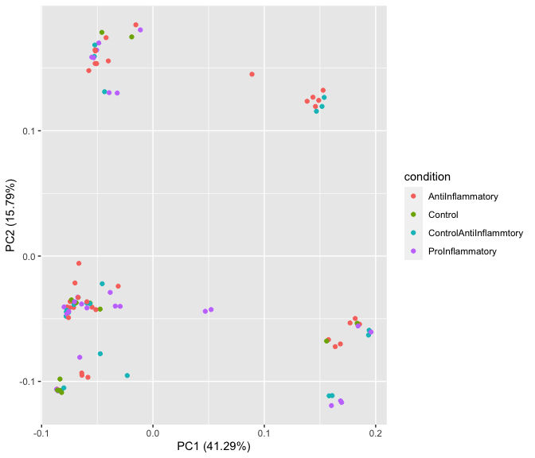

bulkseq endos analysis
================

This is an analysis performed on the bulk RNA-Seq dataset

The workflow is as follows:  
1. Inspect variance in the dataset (Filtering, Normalization, PCA)  
2. Perform differential expression analysis (Using limma)  
3. Annotate biological signatures found by DEA (GSEA)

### Counts list

``` r
dat = read.csv('/Users/skander/Library/CloudStorage/OneDrive-Personnel/Documents/UDEM/Master/BulkData/data/Endo/mycountmatrix.csv',header = TRUE, sep = ";", row.names = 1 )
dat = subset(dat, select = -c(S91.1) )
knitr::kable(dat[1:10, 1:12], caption ="A Knitr kable")
```

|                 |     S114 |    S115 |    S116 |    S117 |    S118 |    S121 |    S122 |    S123 |    S124 |     S125 |     S126 |     S127 |
|:----------------|---------:|--------:|--------:|--------:|--------:|--------:|--------:|--------:|--------:|---------:|---------:|---------:|
| ENSG00000000003 |   164.00 |  222.00 |  218.00 |  215.00 |  258.00 |  285.00 |  306.00 |  261.00 |  289.00 |    98.00 |   102.00 |    74.00 |
| ENSG00000000005 |     2.00 |    4.00 |    1.00 |    0.00 |    0.00 |    0.00 |    0.00 |    1.00 |    2.00 |     1.00 |     0.00 |     0.00 |
| ENSG00000000419 |   499.00 |  564.00 |  543.00 |  589.00 |  561.00 |  726.00 |  683.00 |  689.00 |  688.00 |   391.00 |   349.00 |   276.00 |
| ENSG00000000457 |   470.95 |  171.49 |  174.21 |  188.85 |  126.95 |  152.31 |  189.14 |  184.29 |  175.25 |   667.27 |   583.16 |   526.56 |
| ENSG00000000460 |    68.05 |  158.51 |  153.79 |  141.15 |  306.05 |  357.69 |  294.86 |  303.71 |  300.75 |    56.73 |    47.84 |    37.44 |
| ENSG00000000938 |     1.00 |    1.00 |    0.00 |    2.00 |    0.00 |    0.00 |    0.00 |    0.00 |    1.00 |     4.00 |     0.00 |     0.00 |
| ENSG00000000971 | 32098.85 | 6987.76 | 7215.98 | 7405.73 | 3545.06 | 3412.99 | 2802.98 | 3201.92 | 3255.76 | 20662.66 | 17773.85 | 14512.06 |
| ENSG00000001036 |   893.02 | 1030.37 |  974.90 | 1052.08 |  974.84 |  848.96 |  836.29 |  864.86 |  797.46 |   615.99 |   576.29 |   448.47 |
| ENSG00000001084 |   635.00 |  807.00 |  881.00 |  822.00 |  520.00 |  324.00 |  331.00 |  387.00 |  316.00 |   365.00 |   342.00 |   296.00 |
| ENSG00000001167 |   404.00 |  499.00 |  472.00 |  467.00 |  539.00 |  594.00 |  637.00 |  613.00 |  574.00 |   314.00 |   269.00 |   254.00 |

A Knitr kable

``` r
#length(colnames(dat))
```

### Meta data

``` r
meta = read.xlsx('/Users/skander/Library/CloudStorage/OneDrive-Personnel/Documents/UDEM/Master/BulkData/data/Endo/20220721_Metadata_bulkseq_endos_run1.xlsx')
rownames(meta) <- paste0("S",meta$New.tube.label,sep = "")
meta$RNA.iso.date <- as.Date(meta$RNA.iso.date, origin="1900-01-01")
meta$RNA.iso.date <- factor(meta$RNA.iso.date)
meta$Prep <- factor(meta$Prep)
names(meta)[names(meta) == "Proj.3(Cyto)"] <- "proj.Cyto"
names(meta)[names(meta) == "Proj1(37)"] <- "proj.IL37"
names(meta)[names(meta) == "Proj2(IL4)"] <- "proj.IL4"
names(meta)[names(meta) == "Flowcell#"] <- "Flowcell"
meta$proj.Cyto[2]="Cyto"
meta$proj.Cyto[5]="Cyto"
meta$stim[8]="IL1b"

meta$stim=gsub("40% ACM","ACM40",meta$stim)
meta$condition <- "NA"
meta$stimConc = "NA"
for(i in 1:nrow(meta)){
    if(meta$stim[i]=="IL23"|meta$stim[i]=="IL1b"|meta$stim[i]=="TNFa"|meta$stim[i]=="IFNg"|meta$stim[i]=="IL6"|meta$stim[i]=="IL17"|meta$stim[i]=="GMCSF"){
        meta$condition[i] <- "ProInflammatory"
    }
    else if(meta$stim[i]=="IL35"|meta$stim[i]=="IL10"|meta$stim[i]=="TGFB1"|meta$stim[i]=="IL37"|meta$stim[i]=="IL4"){
        meta$condition[i]<-"AntiInflammatory"
    }
    else if(meta$stim[i]=="IT"|meta$stim[i]=="ECM"|meta$stim[i]=="ACM40"){
        meta$condition[i]<-"Control"
    }
    else{
        meta$condition[i]<-"ControlAntiInflammtory"
    }
}

#for(i in 1:nrow(meta)){
#    if(rownames(meta)[i]=="S109"){
#        meta$test[i] <- "109"
#    }
#    else if(rownames(meta)[i]=="S110"){
#        meta$test[i] <- "110"
#    }
#    else if(rownames(meta)[i]=="S111"){
#        meta$test[i] <- "111"
#    }
#    else if(rownames(meta)[i]=="S197"){
#        meta$test[i] <- "197"
#    }
#    else if(rownames(meta)[i]=="S198"){
#        meta$test[i] <- "198"
#    } 
#    else if(rownames(meta)[i]=="S199"){
#        meta$test[i] <- "199"
#    }
#    else{
#        meta$test[i] <- "other"
#    }
#} 
    
meta <- meta %>% dplyr::select(Prep,size,p,stim,condition, everything())   
genomic_idx <- match(rownames(meta), colnames(dat))
dat  <- dat[ , genomic_idx]
meta$sizeMerge = "NA"
for(i in 1:nrow(meta)){
    if(meta$size[i]==">30"|meta$size[i]=="<30"){
        meta$sizeMerge[i] <- "HMEC"
    }
    else{
        meta$sizeMerge[i] <- "HBEC"
    }
}


knitr::kable(meta[,1:11], caption ="A Knitr kable")
```

|      | Prep | size |   p | stim   | condition              | proj.IL37 | proj.IL4 | proj.Cyto | Flowcell  | conc     | Run.# |
|:-----|:-----|:-----|----:|:-------|:-----------------------|:----------|:---------|:----------|:----------|:---------|------:|
| S91  | 241  | 112  |   3 | IL37   | AntiInflammatory       | IL37      | NA       | NA        | HFFTKBGXM | 1ng/ml   |     4 |
| S92  | 241  | 112  |   3 | IL37   | AntiInflammatory       | IL37      | NA       | Cyto      | HFFTKBGXM | 10ng/ml  |     4 |
| S93  | 241  | 112  |   3 | IL37   | AntiInflammatory       | IL37      | NA       | NA        | HFFTKBGXM | 100ng/ml |     4 |
| S94  | 241  | 112  |   3 | IL4    | AntiInflammatory       | NA        | IL4      | NA        | HFFTKBGXM | 1ng/ml   |     4 |
| S95  | 241  | 112  |   3 | IL4    | AntiInflammatory       | NA        | IL4      | Cyto      | HFFTKBGXM | 10ng/ml  |     4 |
| S96  | 241  | 112  |   3 | IL4    | AntiInflammatory       | NA        | IL4      | NA        | HFFTKBGXM | 100ng/ml |     4 |
| S97  | 241  | 112  |   3 | IL23   | ProInflammatory        | NA        | NA       | Cyto      | HFFTKBGXM | 100ng/ml |     5 |
| S98  | 241  | 112  |   3 | IL1b   | ProInflammatory        | NA        | NA       | Cyto      | HFFTKBGXM | 1ng/ml   |     5 |
| S99  | 241  | 112  |   3 | IL6    | ProInflammatory        | NA        | NA       | Cyto      | HFFTKBGXM | 100ng/ml |     5 |
| S100 | 241  | 112  |   3 | it+37  | ControlAntiInflammtory | IL37      | NA       | NA        | HFFTKBGXM | 1ng/ml   |     5 |
| S101 | 241  | 112  |   3 | it+37  | ControlAntiInflammtory | IL37      | NA       | NA        | HFFTKBGXM | 10ng/ml  |     5 |
| S102 | 241  | 112  |   3 | it+37  | ControlAntiInflammtory | IL37      | NA       | NA        | HFFTKBGXM | 100ng/ml |     5 |
| S103 | 241  | 112  |   3 | it+IL4 | ControlAntiInflammtory | NA        | IL4      | NA        | HFFTKBGXM | 1ng/ml   |     5 |
| S104 | 241  | 112  |   3 | it+IL4 | ControlAntiInflammtory | NA        | IL4      | NA        | HFFTKBGXM | 10ng/ml  |     5 |
| S105 | 241  | 112  |   3 | it+IL4 | ControlAntiInflammtory | NA        | IL4      | NA        | HFFTKBGXM | 100ng/ml |     5 |
| S106 | 241  | 112  |   3 | IL10   | AntiInflammatory       | NA        | NA       | Cyto      | HFFTKBGXM | 1ng/ml   |     5 |
| S107 | 241  | 112  |   3 | TGFB1  | AntiInflammatory       | NA        | NA       | Cyto      | HFFTKBGXM | 100ng/ml |     5 |
| S109 | 241  | 112  |   3 | IL17   | ProInflammatory        | NA        | NA       | Cyto      | HFFTKBGXM | 100ng/ml |     5 |
| S110 | 241  | 112  |   3 | GMCSF  | ProInflammatory        | NA        | NA       | Cyto      | HFFTKBGXM | 100ng/ml |     5 |
| S111 | 241  | 112  |   3 | IL35   | AntiInflammatory       | NA        | NA       | Cyto      | HFFTKBGXM | 10ng/ml  |     5 |
| S114 | 241  | 112  |   3 | ECM    | Control                | IL37      | IL4      | Cyto      | H2V22BGXM | NA       |     5 |
| S115 | 241  | 112  |   3 | ACM40  | Control                | IL37      | IL4      | Cyto      | H2V22BGXM | NA       |     5 |
| S116 | 241  | 112  |   3 | IT     | Control                | IL37      | IL4      | Cyto      | H2V22BGXM | NA       |     5 |
| S117 | 241  | 112  |   3 | IFNg   | ProInflammatory        | NA        | NA       | Cyto      | H2V22BGXM | NA       |     5 |
| S118 | 241  | 112  |   3 | TNFa   | ProInflammatory        | NA        | NA       | Cyto      | H2V22BGXM | NA       |     5 |
| S121 | 240  | 112  |   3 | it+IL4 | ControlAntiInflammtory | NA        | IL4      | NA        | H2V22BGXM | 1ng/ml   |     6 |
| S122 | 240  | 112  |   3 | it+IL4 | ControlAntiInflammtory | NA        | IL4      | NA        | H2V22BGXM | 10ng/ml  |     6 |
| S123 | 240  | 112  |   3 | it+IL4 | ControlAntiInflammtory | NA        | IL4      | NA        | H2V22BGXM | 100ng/ml |     6 |
| S124 | 240  | 112  |   3 | it+37  | ControlAntiInflammtory | IL37      | NA       | NA        | H2V22BGXM | 1ng/ml   |     6 |
| S125 | 240  | 112  |   3 | it+37  | ControlAntiInflammtory | IL37      | NA       | NA        | H2V22BGXM | 10ng/ml  |     6 |
| S126 | 240  | 112  |   3 | it+37  | ControlAntiInflammtory | IL37      | NA       | NA        | H2V22BGXM | 100ng/ml |     6 |
| S127 | 240  | 112  |   3 | IL17   | ProInflammatory        | NA        | NA       | Cyto      | H2V22BGXM | 100ng/ml |     6 |
| S128 | 240  | 112  |   3 | GMCSF  | ProInflammatory        | NA        | NA       | Cyto      | H2V22BGXM | 100ng/ml |     6 |
| S129 | 240  | 112  |   3 | IL35   | AntiInflammatory       | NA        | NA       | Cyto      | H2V22BGXM | 10ng/ml  |     6 |
| S130 | 240  | 112  |   3 | IL37   | AntiInflammatory       | IL37      | NA       | NA        | H2V22BGXM | 1ng/ml   |     6 |
| S131 | 240  | 112  |   3 | IL37   | AntiInflammatory       | IL37      | NA       | NA        | H2V22BGXM | 10ng/ml  |     6 |
| S132 | 240  | 112  |   3 | IL37   | AntiInflammatory       | IL37      | NA       | NA        | H2V22BGXM | 100ng/ml |     6 |
| S133 | 240  | 112  |   3 | ECM    | Control                | IL37      | IL4      | Cyto      | H2V22BGXM | NA       |     6 |
| S134 | 240  | 112  |   3 | IT     | Control                | IL37      | IL4      | Cyto      | H2V22BGXM | NA       |     6 |
| S135 | 240  | 112  |   3 | IL23   | ProInflammatory        | NA        | NA       | Cyto      | H2V22BGXM | 100ng/ml |     6 |
| S136 | 240  | 112  |   3 | IL1b   | ProInflammatory        | NA        | NA       | Cyto      | HFF7HBGXM | 1ng/ml   |     6 |
| S137 | 240  | 112  |   3 | IL6    | ProInflammatory        | NA        | NA       | Cyto      | HFF7HBGXM | 100ng/ml |     6 |
| S138 | 240  | 112  |   3 | IL4    | AntiInflammatory       | NA        | IL4      | NA        | HFF7HBGXM | 1ng/ml   |     6 |
| S139 | 240  | 112  |   3 | IL4    | AntiInflammatory       | NA        | IL4      | NA        | HFF7HBGXM | 10ng/ml  |     6 |
| S140 | 240  | 112  |   3 | IL4    | AntiInflammatory       | NA        | IL4      | NA        | HFF7HBGXM | 100ng/ml |     6 |
| S141 | 240  | 112  |   3 | IL10   | AntiInflammatory       | NA        | NA       | Cyto      | HFF7HBGXM | 1ng/ml   |     6 |
| S142 | 240  | 112  |   3 | TGFB1  | AntiInflammatory       | NA        | NA       | Cyto      | HFF7HBGXM | 100ng/ml |     6 |
| S146 | 240  | 112  |   3 | ACM40  | Control                | IL37      | IL4      | Cyto      | HFF7HBGXM | NA       |     7 |
| S147 | 240  | 112  |   3 | IFNg   | ProInflammatory        | NA        | NA       | Cyto      | HFF7HBGXM | NA       |     7 |
| S148 | 240  | 112  |   3 | TNFa   | ProInflammatory        | NA        | NA       | Cyto      | HFF7HBGXM | NA       |     7 |
| S150 | 241  | \<30 |   3 | IL10   | AntiInflammatory       | NA        | NA       | Cyto      | HFF7HBGXM | 1ng/ml   |     7 |
| S151 | 241  | \<30 |   3 | TGFB1  | AntiInflammatory       | NA        | NA       | Cyto      | HFF7HBGXM | 100ng/ml |     7 |
| S152 | 241  | \<30 |   3 | IL37   | AntiInflammatory       | IL37      | NA       | NA        | HFF7HBGXM | 1ng/ml   |     7 |
| S153 | 241  | \<30 |   3 | IL37   | AntiInflammatory       | IL37      | NA       | NA        | HFF7HBGXM | 10ng/ml  |     7 |
| S154 | 241  | \<30 |   3 | IL37   | AntiInflammatory       | IL37      | NA       | NA        | HFF7HBGXM | 100ng/ml |     7 |
| S155 | 241  | \<30 |   3 | it+IL4 | ControlAntiInflammtory | NA        | IL4      | NA        | HFF7HBGXM | 1ng/ml   |     7 |
| S156 | 241  | \<30 |   3 | it+IL4 | ControlAntiInflammtory | NA        | IL4      | NA        | HFF7HBGXM | 10ng/ml  |     7 |
| S157 | 241  | \<30 |   3 | it+IL4 | ControlAntiInflammtory | NA        | IL4      | NA        | HFF7HBGXM | 100ng/ml |     7 |
| S158 | 241  | \<30 |   3 | IL23   | ProInflammatory        | NA        | NA       | Cyto      | HFF7HBGXM | 100ng/ml |     7 |
| S159 | 241  | \<30 |   3 | IL1b   | ProInflammatory        | NA        | NA       | Cyto      | HFF7HBGXM | 1ng/ml   |     7 |
| S160 | 241  | \<30 |   3 | IL6    | ProInflammatory        | NA        | NA       | Cyto      | HFGNNBGXM | 100ng/ml |     7 |
| S161 | 241  | \<30 |   3 | IL17   | ProInflammatory        | NA        | NA       | Cyto      | HFGNNBGXM | 100ng/ml |     7 |
| S162 | 241  | \<30 |   3 | GMCSF  | ProInflammatory        | NA        | NA       | Cyto      | HFGNNBGXM | 100ng/ml |     7 |
| S163 | 241  | \<30 |   3 | IL35   | AntiInflammatory       | NA        | NA       | Cyto      | HFGNNBGXM | 10ng/ml  |     7 |
| S164 | 241  | \<30 |   3 | it+37  | ControlAntiInflammtory | IL37      | NA       | NA        | HFGNNBGXM | 1ng/ml   |     7 |
| S165 | 241  | \<30 |   3 | it+37  | ControlAntiInflammtory | IL37      | NA       | NA        | HFGNNBGXM | 10ng/ml  |     7 |
| S166 | 241  | \<30 |   3 | it+37  | ControlAntiInflammtory | IL37      | NA       | NA        | HFGNNBGXM | 100ng/ml |     7 |
| S167 | 241  | \<30 |   3 | IL4    | AntiInflammatory       | NA        | IL4      | NA        | HFGNNBGXM | 1ng/ml   |     7 |
| S168 | 241  | \<30 |   3 | IL4    | AntiInflammatory       | NA        | IL4      | NA        | HFGNNBGXM | 10ng/ml  |     7 |
| S169 | 241  | \<30 |   3 | IL4    | AntiInflammatory       | NA        | IL4      | NA        | HFGNNBGXM | 100ng/ml |     8 |
| S170 | 241  | \<30 |   3 | ACM40  | Control                | IL37      | IL4      | Cyto      | HFGNNBGXM | NA       |     8 |
| S171 | 241  | \<30 |   3 | IFNg   | ProInflammatory        | NA        | NA       | Cyto      | HFGNNBGXM | NA       |     8 |
| S172 | 241  | \<30 |   3 | TNFa   | ProInflammatory        | NA        | NA       | Cyto      | HFGNNBGXM | NA       |     8 |
| S173 | 240  | \>30 |   3 | IL4    | AntiInflammatory       | NA        | IL4      | NA        | HFGNNBGXM | 1ng/ml   |     8 |
| S174 | 240  | \>30 |   3 | IL4    | AntiInflammatory       | NA        | IL4      | NA        | HFGNNBGXM | 10ng/ml  |     8 |
| S175 | 240  | \>30 |   3 | IL4    | AntiInflammatory       | NA        | IL4      | NA        | HFGNNBGXM | 100ng/ml |     8 |
| S176 | 240  | \>30 |   3 | IL10   | AntiInflammatory       | NA        | NA       | Cyto      | HFGNNBGXM | 1ng/ml   |     8 |
| S177 | 240  | \>30 |   3 | TGFB1  | AntiInflammatory       | NA        | NA       | Cyto      | HFGNNBGXM | 100ng/ml |     8 |
| S178 | 240  | \>30 |   3 | ECM    | Control                | IL37      | IL4      | Cyto      | HFGNNBGXM | NA       |     8 |
| S179 | 240  | \>30 |   3 | IL17   | ProInflammatory        | NA        | NA       | Cyto      | HFGNNBGXM | 100ng/ml |     8 |
| S180 | 240  | \>30 |   3 | GMCSF  | ProInflammatory        | NA        | NA       | Cyto      | HFGNTBGXM | 100ng/ml |     8 |
| S181 | 240  | \>30 |   3 | IL35   | AntiInflammatory       | NA        | NA       | Cyto      | HFGNTBGXM | 10ng/ml  |     8 |
| S182 | 240  | \>30 |   3 | IL37   | AntiInflammatory       | IL37      | NA       | NA        | HFGNTBGXM | 1ng/ml   |     8 |
| S183 | 240  | \>30 |   3 | IL37   | AntiInflammatory       | IL37      | NA       | NA        | HFGNTBGXM | 10ng/ml  |     8 |
| S184 | 240  | \>30 |   3 | IL37   | AntiInflammatory       | IL37      | NA       | NA        | HFGNTBGXM | 100ng/ml |     8 |
| S185 | 240  | \>30 |   3 | it+IL4 | ControlAntiInflammtory | NA        | IL4      | NA        | HFGNTBGXM | 1ng/ml   |     8 |
| S186 | 240  | \>30 |   3 | it+IL4 | ControlAntiInflammtory | NA        | IL4      | NA        | HFGNTBGXM | 10ng/ml  |     8 |
| S187 | 240  | \>30 |   3 | it+IL4 | ControlAntiInflammtory | NA        | IL4      | NA        | HFGNTBGXM | 100ng/ml |     8 |
| S188 | 240  | \>30 |   3 | it+37  | ControlAntiInflammtory | IL37      | NA       | NA        | HFGNTBGXM | 1ng/ml   |     8 |
| S189 | 240  | \>30 |   3 | it+37  | ControlAntiInflammtory | IL37      | NA       | NA        | HFGNTBGXM | 10ng/ml  |     8 |
| S190 | 240  | \>30 |   3 | it+37  | ControlAntiInflammtory | IL37      | NA       | NA        | HFGNTBGXM | 100ng/ml |     8 |
| S191 | 240  | \>30 |   3 | IL23   | ProInflammatory        | NA        | NA       | Cyto      | HFGNTBGXM | 100ng/ml |     8 |
| S192 | 240  | \>30 |   3 | IL1b   | ProInflammatory        | NA        | NA       | Cyto      | HFGNTBGXM | 1ng/ml   |     8 |
| S193 | 240  | \>30 |   3 | IL6    | ProInflammatory        | NA        | NA       | Cyto      | HFGNTBGXM | 100ng/ml |     9 |
| S194 | 240  | \>30 |   3 | IT     | Control                | IL37      | IL4      | Cyto      | HFGNTBGXM | NA       |     9 |
| S195 | 240  | \>30 |   3 | IFNg   | ProInflammatory        | NA        | NA       | Cyto      | HFGNTBGXM | NA       |     9 |
| S196 | 240  | \>30 |   3 | TNFa   | ProInflammatory        | NA        | NA       | Cyto      | HFGNTBGXM | NA       |     9 |
| S197 | 240  | \>30 |   3 | ACM40  | Control                | IL37      | IL4      | Cyto      | HFGNTBGXM | NA       |     9 |
| S198 | 241  | \<30 |   3 | IT     | Control                | IL37      | IL4      | Cyto      | HFGNTBGXM | NA       |     9 |
| S199 | 241  | \<30 |   3 | ECM    | Control                | IL37      | IL4      | Cyto      | HFGNTBGXM | NA       |     9 |

A Knitr kable

``` r
metaF = read.xlsx('/Users/skander/Library/CloudStorage/OneDrive-Personnel/Documents/UDEM/Master/BulkData/data/Endo/20220815_Overview_bulkseq_endo_cytokines_FIXED_v1.xlsx')
rownames(metaF) <- paste0("S",metaF$New.tube.label,sep = "") 
names(metaF)[names(metaF) == "Flowcell#"] <- "Flowcell"
genomic_idx <- match(rownames(meta), colnames(dat))
dat  <- dat[ , genomic_idx]
metaF$Cytokine <- gsub("TGFB1","TGFb1",metaF$Cytokine)
metaF$Cytokine <- gsub("TGFB","TGFb1",metaF$Cytokine)
metaF$Cytokine <- gsub("IL1B","IL1b",metaF$Cytokine)
#knitr::kable(metaF, caption ="A Knitr kable")

sign_cols=c(DN='deepskyblue',NS='grey80',UP='tomato')
go = read.gmt('/Users/skander/Library/CloudStorage/OneDrive-Personnel/Documents/UDEM/Master/BulkData/GO/c5.go.bp.v7.5.1.symbols.gmt')
mf = read.gmt('/Users/skander/Library/CloudStorage/OneDrive-Personnel/Documents/UDEM/Master/BulkData/GO/c5.go.mf.v7.5.1.symbols.gmt')
kegg = read.gmt('/Users/skander/Library/CloudStorage/OneDrive-Personnel/Documents/UDEM/Master/BulkData/GO/c2.cp.kegg.v7.5.1.symbols.gmt')
tft = read.gmt('/Users/skander/Library/CloudStorage/OneDrive-Personnel/Documents/UDEM/Master/BulkData/GO/c3.tft.v7.5.1.symbols.gmt')
## Differential expression analysis with limma-voom

### Filtering to remove lowly expressed genes + Normalization for composition bias

d0 <- DGEList(dat)
d0 <- calcNormFactors(d0)
cutoff <- 2
drop <- which(apply(cpm(d0), 1, max) < cutoff)
d <- d0[-drop,]


mmF <- model.matrix(~ 0 + Cytokine, data=metaF[colnames(d),])
yF <- voom(d, mmF, plot = F)
```

## Differential expression analysis with limma-voom

### Filtering to remove lowly expressed genes + Normalization for composition bias

use the *edgeR/limma* workflow to filter out lowly expressed genes.
*Voom* is used to normalize the raw counts. A linear mixed model is used
to fit the expression values. Defining the model is done with the
model.matrix function of edgeR. In the model are included factors of
interest (group). If a batch/patient effect is detected, it can be added
to the model to account for its effect.

``` r
d0 <- DGEList(dat)
d0 <- calcNormFactors(d0)
cutoff <- 2
drop <- which(apply(cpm(d0), 1, max) < cutoff)
d <- d0[-drop,]


mm <- model.matrix(~ 0 + stim + Flowcell , data=meta[colnames(d),])

# Without filtering low expressed genes
y <- voom(d0, mm, plot = T)
```

<!-- -->

``` r
# Filtering low expressed genes
y <- voom(d, mm, plot = T)
```

<!-- -->

``` r
##gene name reference(ref_G)
conv_B=AnnotationDbi::select(org.Hs.eg.db,keys=rownames(y$E),keytype='ENSEMBL',columns=c('GENENAME','SYMBOL'))
```

    ## 'select()' returned 1:many mapping between keys and columns

``` r
ref_G=conv_B[!duplicated(conv_B[,1]),]
rownames(ref_G)=ref_G[,1]
##
```

## PCA

Perform a *PCA* on the normalized samples and identify main factors of
variation.

``` r
### PCA ALL PROJECT Version Modif
pcaF = prcomp(t(yF$E))
metaF=metaF[colnames(yF$E),]
metaF$PC1 = pcaF$x[,1]
metaF$PC2 = pcaF$x[,2]
meta=data.frame(meta)
autoplot(pcaF,data=meta,col="Flowcell",title ="flowcell")
```

<!-- -->

``` r
autoplot(pcaF,data=meta,col='size',title ="size",label = TRUE)
```

<!-- -->

``` r
autoplot(pcaF,data=meta,col='stim',title ="stim")
```

<!-- -->

``` r
### PCA ALL PROJECT First Version
pca = prcomp(t(y$E))
meta=meta[colnames(y$E),]
meta$PC1 = pca$x[,1]
meta$PC2 = pca$x[,2]
meta=data.frame(meta)
#autoplot(pca,data=meta,col='test',title ="condition", label = TRUE, label.size = 5)
autoplot(pca,data=meta,col='condition',title ="condition")
```

<!-- -->

``` r
autoplot(pca,data=meta,col="Flowcell",shape="condition",title ="flowcell")
```

<!-- -->

``` r
autoplot(pca,data=meta,col='RNA.iso.date',shape="condition",title ="RNA.iso.date")
```

<!-- -->

``` r
autoplot(pca,data=meta,col='size',shape="condition",title ="size",label = TRUE)
```

<!-- -->

``` r
autoplot(pca,data=meta,col='sizeMerge',shape="size",title ="size")
```

<!-- -->

``` r
autoplot(pca,data=meta,col='stim',shape="condition",title ="stim")
```

<!-- -->

``` r
autoplot(pca,data=meta,col='Prep',shape="condition",title ="Prep")
```

<!-- -->

``` r
#BDCorrB <- removeBatchEffect(y$E,batch = meta$Flowcell)
#BD1B <- prcomp(t(BDCorrB))
#autoplot(BD1B,data=meta,col="Flowcell",title ="flowcell")

BDCorrB <- removeBatchEffect(y$E,batch = meta$Flowcell)
BD1B <- pca(BDCorrB, metadata = meta)
biplot(BD1B, colby = 'size',shape = 'condition', hline = 0, vline = 0,legendPosition = 'right', lab="",title="size")
```

<!-- -->

``` r
biplot(BD1B, colby = 'sizeMerge',shape = 'condition', hline = 0, vline = 0,legendPosition = 'right', lab="",title="sizeMerge")
```

<!-- -->

\#`{r  echo=TRUE, message=FALSE, warning=FALSE, paged.print=TRUE, fig.width = 9, fig.height = 8} #meta$showPCA=paste(meta$New.tube.label,meta$stim,sep="-") #library(autoplotly) #autoplotly(pca,data=meta,col='sizeMerge',fill="showPCA",shape="size",title ="size") #`

``` r
mcor <- cor(y$E)
#library(corrplot)
#corrplot(mcor,type="upper", order="hclust",tl.col="black", tl.srt=45)
col <- colorRampPalette(c("blue","white","red"))(20)
heatmap(x=mcor, col=col, symm=TRUE)
```

<!-- -->

## Differential expression analysis with limma-voom (My project Cyto)

### Filtering to remove lowly expressed genes + Normalization for composition bias

``` r
d0 <- DGEList(dat)
d0 <- calcNormFactors(d0)
cutoff <- 2
drop <- which(apply(cpm(d0), 1, max) < cutoff)
d <- d0[-drop,]

metaCyto <- subset(meta, proj.Cyto=="Cyto")
mmC <- model.matrix(~ 0 +stim+Flowcell, data=metaCyto[colnames(d),])


# Filtering low expressed genes
yC <- voom(d[,rownames(metaCyto)], mmC, plot = F)

pcaC = prcomp(t(yC$E))
metaCyto=metaCyto[colnames(yC$E),]
autoplot(pcaC,data=metaCyto,col="condition",title ="condition")
```

<!-- -->

``` r
autoplot(pcaC,data=metaCyto,col="Flowcell",title ="Flowcell")
```

<!-- -->

``` r
autoplot(pcaC,data=metaCyto,col='RNA.iso.date',shape="condition",title ="RNA.iso.date")
```

<!-- -->

``` r
autoplot(pcaC,data=metaCyto,col='size',shape="condition",title ="size")
```

<!-- -->

``` r
autoplot(pcaC,data=metaCyto,col='stim',shape="condition",title ="stim")
```

<!-- -->

``` r
autoplot(pcaC,data=metaCyto,col='Prep',shape="condition",title ="Prep")
```

<!-- -->

## Plot Gene

``` r
meta$stimConc <- paste(meta$stim,meta$conc)
meta$stimConc <- gsub("ng/ml","",meta$stimConc)
meta$stimConc <- gsub("NA","",meta$stimConc)

plot.geneF <- function(x){
    geneEns <- subset(ref_G,SYMBOL==x)$ENSEMBL
    metaF$gene = yF$E[geneEns,rownames(metaF)]
    ggplot(metaF,aes(Cytokine,gene))+geom_boxplot()+geom_point(aes(col=Size))+ggtitle(x)+theme_bw()
}
plot.gene <- function(x){
    geneEns <- subset(ref_G,SYMBOL==x)$ENSEMBL
    meta$gene = y$E[geneEns,rownames(meta)]
    ggplot(meta,aes(stimConc,gene))+geom_boxplot()+geom_point(aes(col=sizeMerge))+ggtitle(x)+theme_bw()+theme(axis.text.x=element_text(angle=60,hjust=1))
}

metaF$New.tube.label <- factor(metaF$New.tube.label)
metaF$conc <- factor(metaF$conc)
plot.geneIl37 <- function(x){
    geneEns <- subset(ref_G,SYMBOL==x)$ENSEMBL
    metaF$gene = yF$E[geneEns,rownames(metaF)]
    ggplot(metaF[c("S100","S101","S102","S124","S125","S126","S164","S165","S166","S188","S189","S190"),],aes(conc,gene))+geom_boxplot()+geom_point(aes(col=New.tube.label))+ggtitle(x)+theme_bw()
}


plot.geneF("VCAM1")
```

<!-- -->

``` r
plot.gene("VCAM1")
```

<!-- -->

``` r
#plot.geneIl37("GBP1")
```

``` r
meta$New.tube.label <- factor(meta$New.tube.label)
meta$conc <- factor(meta$conc)
plot.geneSubset <- function(x){
    geneEns <- subset(ref_G,SYMBOL==x)$ENSEMBL
    meta$gene = y$E[geneEns,rownames(meta)]
    y="IL4"
    ggplot(subset(meta,stim==y),aes(conc,gene))+geom_boxplot()+geom_point(aes(col=New.tube.label))+ggtitle(label = x,
              subtitle = y)+theme_bw()
}
plot.geneSubset("VCAM1")
```

<!-- -->

## Clustering

``` r
hc=hclust(dist(t(BDCorrB)), method='ward.D2')
hc_clus=data.frame(cutree(hc, k=3))
hc_clus[,1]=paste0('C',hc_clus[,1])
meta$clus_hm=hc_clus[rownames(meta),1]
t=data.frame(table(meta$clus_hm))

plot(hc)
```

<!-- -->

``` r
ggplot(t,aes(Var1,Freq))+geom_col(fill=c('darkolivegreen3','brown3','skyblue'))+theme_bw()
```

<!-- -->

``` r
autoplot(prcomp(t(BDCorrB)),data=meta, col='clus_hm')+theme_bw()
```

<!-- -->

``` r
summarize_col<-function(col){
  t=table(meta[,c('clus_hm' ,col)])
  for(i in 1:ncol(t)){t[,i]=t[,i]/sum(t[,i])}
  for(i in 1:nrow(t)){t[i, ]=t[i,]/sum(t[i,])}
  t=data.frame(t)
  p=ggplot(t,aes(clus_hm,Freq,fill=t[,col]))+geom_col(col='white')+labs(fill=col)+theme_bw()
return(p)
}

#p1=summarize_col('New.tube.label')
p2=summarize_col('size')
p3=summarize_col('sizeMerge')
p4=summarize_col('Flowcell')+scale_fill_manual(values=c('grey10','grey25','grey50','grey75','grey90'))
p5=summarize_col('condition')
p6=summarize_col('stim')
p7=summarize_col('conc')

cowplot::plot_grid(p2,p3,p4,p5,p6,p7,ncol=3)
```

<!-- -->

## Comparisons between cluster

``` r
mmG <- model.matrix(~ 0 + clus_hm+Flowcell, data=meta[colnames(d),])

# Filtering low expressed genes
yG <- voom(d[,rownames(meta)], mmG, plot = F)

fitG <- lmFit(yG, mmG)
contrG <- makeContrasts(
  A = clus_hmC1 - clus_hmC2,
  B = clus_hmC1 - clus_hmC3,
  C = clus_hmC2 - clus_hmC3,
  levels = colnames(coef(fitG)))
tmpG <- contrasts.fit(fitG, contrG)
tmpG <- eBayes(tmpG) 

res <- list()
res[['C1_vs_C2']] <- topTable(tmpG, sort.by = "P", n = Inf,coef='A')
res[['C1_vs_C3']] <- topTable(tmpG, sort.by = "P", n = Inf,coef='B')
res[['C2_vs_C3']] <- topTable(tmpG, sort.by = "P", n = Inf,coef='C')

res[['C1_vs_C2']]$comp='C1_vs_C2'
res[['C1_vs_C3']]$comp='C1_vs_C3'
res[['C2_vs_C3']]$comp='C2_vs_C3'
res=do.call(rbind,res)
res$sign = 'NS'
res[which(res$adj.P.Val<0.01&res$logFC>0.5),'sign']='UP'
res[which(res$adj.P.Val<0.01&res$logFC<(-0.5)),'sign']='DN'
res$gene_name=ref_G[gsub(".+\\.","",rownames(res)),3]

ggplot(res,aes(logFC,-log10(P.Value),col=sign))+geom_point()+facet_grid(~comp)+theme_bw()+scale_color_manual(values=sign_cols)
```

<!-- -->

## Gene set enrichment analysis(PCA)

``` r
pca = prcomp(t(BDCorrB))$x[,1:2]
pvals=c()
est=c()
for(i in 1:nrow(BDCorrB)){
  pvals = c(pvals,cor.test(BDCorrB[i,],pca[,1])$p.value)
  est = c(est,cor.test(BDCorrB[i,],pca[,1])$estimate)
}
names(pvals)=rownames (BDCorrB)
names(pvals)=ref_G[names(pvals),3]
pvals=pvals[!is.na(names(pvals))]

names(est)=rownames(BDCorrB)
names(est)=ref_G[names(est),3]
est=est[!is.na(names(est))]

df = data.frame(cbind(pvals,est[names(pvals)]))
df$gene = rownames(df)
pvals=c()
est=c()
for(i in 1:nrow(BDCorrB)){
  pvals = c(pvals,cor.test(BDCorrB[i,],pca[,2])$p.value)
  est = c(est,cor.test(BDCorrB[i, ],pca[,2])$estimate)
}
names(pvals)=rownames(BDCorrB)
names(pvals)=ref_G[names(pvals),3]
pvals=pvals[!is.na(names(pvals))]

names(est)=rownames(BDCorrB)
names(est)=ref_G[names(est),3]
est=est[!is.na(names(est))]

df2=data.frame(cbind(pvals,est[names(pvals)]))

df$pval_pc2=df2[rownames(df),1]
df$est_pc2=df2[rownames(df),2]

vec1=df[,2]
vec2=df[,4]

names(vec1)=rownames(df)
names(vec2)=rownames(df)

gsea_res1=fgsea(pathways=go,stats=vec1)
gsea_res2=fgsea(pathways=go,stats=vec2)

head(gsea_res1[order(gsea_res1$padj),],30)
```

    ##                                                                            pathway
    ##  1:                                                          GOBP_DEFENSE_RESPONSE
    ##  2:                                                           GOBP_IMMUNE_RESPONSE
    ##  3:                                        GOBP_DEFENSE_RESPONSE_TO_OTHER_ORGANISM
    ##  4: GOBP_BIOLOGICAL_PROCESS_INVOLVED_IN_INTERSPECIES_INTERACTION_BETWEEN_ORGANISMS
    ##  5:                                                    GOBP_INNATE_IMMUNE_RESPONSE
    ##  6:                                       GOBP_REGULATION_OF_IMMUNE_SYSTEM_PROCESS
    ##  7:                                                      GOBP_RESPONSE_TO_CYTOKINE
    ##  8:                                             GOBP_REGULATION_OF_IMMUNE_RESPONSE
    ##  9:                              GOBP_POSITIVE_REGULATION_OF_IMMUNE_SYSTEM_PROCESS
    ## 10:                                                        GOBP_CELL_CYCLE_PROCESS
    ## 11:                                       GOBP_CYTOKINE_MEDIATED_SIGNALING_PATHWAY
    ## 12:                                                                GOBP_CELL_CYCLE
    ## 13:                                                        GOBP_MITOTIC_CELL_CYCLE
    ## 14:                                                GOBP_MITOTIC_CELL_CYCLE_PROCESS
    ## 15:                                                       GOBP_CYTOKINE_PRODUCTION
    ## 16:                                                     GOBP_RESPONSE_TO_BACTERIUM
    ## 17:                                                     GOBP_INFLAMMATORY_RESPONSE
    ## 18:                                                  GOBP_ADAPTIVE_IMMUNE_RESPONSE
    ## 19:                                                   GOBP_CHROMOSOME_ORGANIZATION
    ## 20:                                            GOBP_REGULATION_OF_DEFENSE_RESPONSE
    ## 21:                               GOBP_REGULATION_OF_RESPONSE_TO_EXTERNAL_STIMULUS
    ## 22:                                                         GOBP_RESPONSE_TO_VIRUS
    ## 23:                                              GOBP_DEFENSE_RESPONSE_TO_SYMBIONT
    ## 24:                                              GOBP_RESPONSE_TO_INTERFERON_GAMMA
    ## 25:                                                             GOBP_CELL_DIVISION
    ## 26:                                                    GOBP_CHROMOSOME_SEGREGATION
    ## 27:                                                         GOBP_ORGANELLE_FISSION
    ## 28:                              GOBP_IMMUNE_RESPONSE_REGULATING_SIGNALING_PATHWAY
    ## 29:                                            GOBP_NUCLEAR_CHROMOSOME_SEGREGATION
    ## 30:                                                  GOBP_MITOTIC_NUCLEAR_DIVISION
    ##                                                                            pathway
    ##             pval         padj  log2err         ES       NES size
    ##  1: 1.000000e-50 3.818000e-47       NA  0.3981921  3.037933  956
    ##  2: 1.000000e-50 3.818000e-47       NA  0.4154785  3.170595  950
    ##  3: 9.439762e-48 2.402734e-44 1.803094  0.4427646  3.238550  598
    ##  4: 8.426677e-46 1.608653e-42 1.762439  0.3729019  2.842187  960
    ##  5: 3.262467e-43 4.982439e-40 1.714797  0.4618209  3.288135  471
    ##  6: 1.468316e-40 1.868677e-37 1.659565  0.3644386  2.764064  874
    ##  7: 1.012569e-35 1.104568e-32 1.556544  0.3892723  2.856587  641
    ##  8: 1.090100e-32 1.040500e-29 1.488540  0.4088922  2.932679  514
    ##  9: 2.498820e-31 2.120110e-28 1.453345  0.3932277  2.829633  521
    ## 10: 1.886484e-30 1.440519e-27 1.431812 -0.3196767 -2.442669  985
    ## 11: 1.017757e-29 7.065081e-27 1.417276  0.4626715  3.106549  313
    ## 12: 9.732641e-27 6.193204e-24 1.342234 -0.2756301 -2.171920 1445
    ## 13: 9.839079e-26 5.366515e-23 1.318889 -0.3303349 -2.475646  769
    ## 14: 9.369821e-26 5.366515e-23 1.318889 -0.3470908 -2.560975  645
    ## 15: 6.959498e-25 3.542849e-22 1.295123  0.3767392  2.694702  484
    ## 16: 8.981978e-25 4.286649e-22 1.287104  0.4208586  2.892121  351
    ## 17: 2.217991e-24 9.962695e-22 1.279034  0.3767511  2.675259  466
    ## 18: 3.036265e-24 1.288051e-21 1.279034  0.4767458  3.098403  233
    ## 19: 1.002308e-23 3.826811e-21 1.262740 -0.3082438 -2.331604  868
    ## 20: 9.590698e-24 3.826811e-21 1.262740  0.3879737  2.695804  404
    ## 21: 1.275689e-23 4.638650e-21 1.262740  0.3388596  2.487095  623
    ## 22: 4.926920e-22 1.710089e-19 1.212545  0.4243921  2.837762  302
    ## 23: 5.629230e-22 1.868904e-19 1.212545  0.4640391  2.991863  224
    ## 24: 4.285907e-21 1.363633e-18 1.186651  0.6070772  3.385216  101
    ## 25: 1.094343e-20 3.342562e-18 1.177893 -0.3416942 -2.456205  534
    ## 26: 1.239615e-20 3.640654e-18 1.177893 -0.4187963 -2.798760  300
    ## 27: 2.504760e-20 7.083833e-18 1.169070 -0.3746125 -2.596599  400
    ## 28: 4.816080e-20 1.313414e-17 1.160180  0.4282213  2.831392  260
    ## 29: 6.990188e-20 1.840589e-17 1.151221 -0.4325027 -2.778570  242
    ## 30: 2.380430e-19 6.058988e-17 1.133090 -0.4142816 -2.716118  266
    ##             pval         padj  log2err         ES       NES size
    ##                                     leadingEdge
    ##  1:      MLKL,ADAR,ZNFX1,PLSCR1,RNF213,NUB1,...
    ##  2:      ADAR,ZNFX1,PLSCR1,CD274,NUB1,DDX58,...
    ##  3:      MLKL,ADAR,ZNFX1,PLSCR1,RNF213,NUB1,...
    ##  4:     MLKL,ADAR,ZNFX1,PLSCR1,CD274,RNF213,...
    ##  5:     ADAR,ZNFX1,PLSCR1,NUB1,DDX58,TRAFD1,...
    ##  6:    ADAR,ZNFX1,PLSCR1,CD274,DDX58,TRAFD1,...
    ##  7:      ADAR,PLSCR1,CD274,NUB1,DDX58,IFIH1,...
    ##  8:    ADAR,ZNFX1,PLSCR1,CD274,DDX58,TRAFD1,...
    ##  9: ZNFX1,PLSCR1,CD274,DDX58,DHX58,TNFSF13B,...
    ## 10:   PTPN11,MAP3K20,TACC2,CDK1,KIF11,TOP2A,...
    ## 11:   ADAR,SAMHD1,USP18,TNFSF13B,IRF7,STAT2,...
    ## 12:   PTPN11,MAP3K20,TACC2,CDK1,KIF11,WDHD1,...
    ## 13:   PTPN11,MAP3K20,TACC2,CDK1,KIF11,WDHD1,...
    ## 14:   MAP3K20,TACC2,CDK1,KIF11,MAD2L1,HSPA2,...
    ## 15:     CD274,DDX58,IFIH1,DHX58,PML,EIF2AK2,...
    ## 16:     ZNFX1,CD274,RNF213,DHX58,IFI44,OPTN,...
    ## 17:      PLSCR1,USP18,CD47,IFI35,AIM2,KARS1,...
    ## 18:     CD274,RNF19B,TNFSF13B,IRF7,TAP1,B2M,...
    ## 19:     CDK1,TOP2A,RPA1,MAD2L1,HSPA2,NAP1L3,...
    ## 20:    ADAR,ZNFX1,PLSCR1,DDX58,TRAFD1,DHX58,...
    ## 21:    ADAR,ZNFX1,PLSCR1,DDX58,TRAFD1,DHX58,...
    ## 22:      MLKL,ADAR,ZNFX1,PLSCR1,DDX58,IFIH1,...
    ## 23:      MLKL,ADAR,ZNFX1,PLSCR1,DDX58,IFIH1,...
    ## 24:          NUB1,CD47,SHFL,GCH1,PTPN2,GBP1,...
    ## 25:     CDK1,KIF11,TOP2A,MAD2L1,SPC24,CDCA3,...
    ## 26:   TOP2A,MAD2L1,SPC24,CENPK,TRIP13,BUB1B,...
    ## 27:   KIF11,TOP2A,MAD2L1,HSPA2,CENPK,TRIP13,...
    ## 28:     PLSCR1,DDX58,IFIH1,DHX58,CD47,IFI35,...
    ## 29:   TOP2A,MAD2L1,SPC24,CENPK,TRIP13,BUB1B,...
    ## 30: KIF11,MAD2L1,CENPK,TRIP13,PPP2R2D,BUB1B,...
    ##                                     leadingEdge

``` r
head(gsea_res2[order(gsea_res2$padj),],30)
```

    ##                                                                                                  pathway
    ##  1:                                                GOBP_TRIGLYCERIDE_RICH_LIPOPROTEIN_PARTICLE_CLEARANCE
    ##  2:                                                             GOBP_NOREPINEPHRINE_BIOSYNTHETIC_PROCESS
    ##  3:                                                        GOBP_REGULATION_OF_CARDIOCYTE_DIFFERENTIATION
    ##  4:                                                GOBP_SPINAL_CORD_OLIGODENDROCYTE_CELL_DIFFERENTIATION
    ##  5:                                               GOBP_POSITIVE_REGULATION_OF_CARDIOCYTE_DIFFERENTIATION
    ##  6:                                                                          GOBP_MOTOR_NEURON_MIGRATION
    ##  7:                                                          GOBP_PROTEIN_LOCALIZATION_TO_EARLY_ENDOSOME
    ##  8:                                                                          GOBP_PRONEPHROS_DEVELOPMENT
    ##  9:                                                                     GOBP_DENDRITIC_SPINE_DEVELOPMENT
    ## 10:                                                                        GOBP_LUNG_SACCULE_DEVELOPMENT
    ## 11:                                                                     GOBP_MYCOTOXIN_METABOLIC_PROCESS
    ## 12:                                                                        GOBP_MAMMARY_GLAND_INVOLUTION
    ## 13:                     GOBP_HETEROPHILIC_CELL_CELL_ADHESION_VIA_PLASMA_MEMBRANE_CELL_ADHESION_MOLECULES
    ## 14:                                  GOBP_NEGATIVE_REGULATION_OF_CHEMOKINE_C_C_MOTIF_LIGAND_5_PRODUCTION
    ## 15:                                     GOBP_NEGATIVE_REGULATION_OF_SMOOTH_MUSCLE_CELL_APOPTOTIC_PROCESS
    ## 16: GOBP_POSITIVE_REGULATION_OF_NUCLEAR_TRANSCRIBED_MRNA_CATABOLIC_PROCESS_DEADENYLATION_DEPENDENT_DECAY
    ## 17:                                                       GOBP_REGULATION_OF_DENDRITIC_SPINE_DEVELOPMENT
    ## 18:                                                         GOBP_REGULATION_OF_METALLOPEPTIDASE_ACTIVITY
    ## 19:                                                                           GOBP_RESPONSE_TO_BACTERIUM
    ## 20:                                                             GOBP_STABILIZATION_OF_MEMBRANE_POTENTIAL
    ## 21:                                                                  GOBP_ADHERENS_JUNCTION_ORGANIZATION
    ## 22:                                                         GOBP_CELLULAR_RESPONSE_TO_FLUID_SHEAR_STRESS
    ## 23:                                                                   GOBP_DENDRITIC_SPINE_MORPHOGENESIS
    ## 24:                                                                    GOBP_ISOCITRATE_METABOLIC_PROCESS
    ## 25:                                                 GOBP_LEARNED_VOCALIZATION_BEHAVIOR_OR_VOCAL_LEARNING
    ## 26:                                        GOBP_NEGATIVE_REGULATION_OF_EXTRACELLULAR_MATRIX_ORGANIZATION
    ## 27:                                      GOBP_POSITIVE_REGULATION_OF_CARDIAC_MUSCLE_CELL_DIFFERENTIATION
    ## 28:                                   GOBP_POSITIVE_REGULATION_OF_PROTEIN_LOCALIZATION_TO_EARLY_ENDOSOME
    ## 29:                                                          GOBP_REGULATION_OF_APOPTOTIC_CELL_CLEARANCE
    ## 30:                                                     GOBP_REGULATION_OF_DENDRITIC_SPINE_MORPHOGENESIS
    ##                                                                                                  pathway
    ##             pval         padj   log2err         ES       NES size
    ##  1: 4.707193e-31 3.586881e-27 1.4462029 -0.9988198 -1.329274    1
    ##  2: 2.604307e-05 9.922411e-02 0.5756103 -0.9895257 -1.316905    1
    ##  3: 4.293645e-05 1.090586e-01 0.5573322  0.8488693  1.452888   22
    ##  4: 7.032368e-05 1.339666e-01 0.5384341  0.9993254  1.382083    2
    ##  5: 1.173516e-04 1.788439e-01 0.5384341  0.9318825  1.524817   12
    ##  6: 2.114554e-04 2.685483e-01 0.5188481 -0.9594983 -1.609633    3
    ##  7: 2.868151e-04 3.122187e-01 0.4984931  0.9442067  1.502596    9
    ##  8: 3.559127e-04 3.390068e-01 0.4984931  0.9891603  1.479103    5
    ##  9: 4.716860e-04 3.474214e-01 0.4984931  0.6817059  1.236595   73
    ## 10: 5.015269e-04 3.474214e-01 0.4772708  0.9709215  1.502124    7
    ## 11: 4.836053e-04 3.474214e-01 0.4984931  0.9986660  1.381171    2
    ## 12: 5.596229e-04 3.553605e-01 0.4772708  0.9851311  1.473079    5
    ## 13: 9.664383e-04 3.682130e-01 0.4772708  0.7668054  1.315970   23
    ## 14: 9.168014e-04 3.682130e-01 0.4772708  0.9888266  1.443270    4
    ## 15: 7.348052e-04 3.682130e-01 0.4772708  0.9828138  1.469613    5
    ## 16: 9.232309e-04 3.682130e-01 0.4772708  0.8604077  1.417548   13
    ## 17: 9.480305e-04 3.682130e-01 0.4772708  0.7100760  1.264697   44
    ## 18: 8.146279e-04 3.682130e-01 0.4772708  0.8965655  1.453306   11
    ## 19: 9.480305e-04 3.682130e-01 0.4772708  0.5829206  1.095232  351
    ## 20: 6.958758e-04 3.682130e-01 0.4772708  0.9833421  1.470404    5
    ## 21: 1.684347e-03 4.510385e-01 0.4550599  0.7194758  1.264739   35
    ## 22: 1.796590e-03 4.510385e-01 0.4550599  0.8042981  1.363294   19
    ## 23: 1.371412e-03 4.510385e-01 0.4550599  0.7002684  1.249632   46
    ## 24: 1.462278e-03 4.510385e-01 0.4550599  0.9654274  1.468008    6
    ## 25: 1.834933e-03 4.510385e-01 0.4550599 -0.8077916 -1.516322    5
    ## 26: 1.564871e-03 4.510385e-01 0.4550599  0.9054169  1.452831   10
    ## 27: 1.725159e-03 4.510385e-01 0.4550599  0.9294366  1.459563    8
    ## 28: 1.761640e-03 4.510385e-01 0.4550599  0.9442120  1.460801    7
    ## 29: 1.296206e-03 4.510385e-01 0.4550599  0.9382909  1.473468    8
    ## 30: 1.665939e-03 4.510385e-01 0.4550599  0.7197737  1.265263   35
    ##             pval         padj   log2err         ES       NES size
    ##                                       leadingEdge
    ##  1:                                          APOE
    ##  2:                                         MOXD1
    ##  3:                         SOX6,ARRB2,DHX36,HEY2
    ##  4:                                    SOX6,SOX13
    ##  5:                                   ARRB2,DHX36
    ##  6:                               RELN,VEGFA,NRP1
    ##  7:                                   DTX3L,MGAT3
    ##  8:                                CEP290,SEC61A1
    ##  9:        LZTS3,DIP2A,DISC1,EFNA1,DHX36,DLG5,...
    ## 10:                                   CREB1,GATA6
    ## 11:                                 NFE2L2,AKR7A3
    ## 12:                                     CAPN1,BAX
    ## 13:                       CD164,FAT4,ICAM1,AMIGO2
    ## 14:                                    OAS3,SIRPA
    ## 15:                                    ARRB2,LRP6
    ## 16:                 TNRC6C,DHX36,AGO2,CPEB3,ZFP36
    ## 17:         DISC1,EFNA1,DHX36,DLG5,CPEB3,SDK1,...
    ## 18:                           STAT3,PICALM,DDRGK1
    ## 19:           CXCL8,OAS2,OAS3,ASS1,IDO1,SIRPA,...
    ## 20:                                 KCNN4,CHCHD10
    ## 21:           CDH24,PTPN23,VCL,TJP1,JAM3,DLG5,...
    ## 22:                    NFE2L2,ASS1,SRC,PTGS2,KLF2
    ## 23:    LZTS3,DIP2A,EFNA1,DHX36,SIPA1L1,PDLIM5,...
    ## 24:                                    ACO2,IDH3G
    ## 25:                  SHANK3,NRXN2,STRA6,HTT,NRXN1
    ## 26:                 ADTRP,TNFRSF1B,EMILIN1,NOTCH1
    ## 27:                                   ARRB2,KAT2A
    ## 28:                                   DTX3L,MGAT3
    ## 29:                                 C3,C4A,C4B,C2
    ## 30: LZTS3,EFNA1,DHX36,SIPA1L1,PDLIM5,ARHGAP44,...
    ##                                       leadingEdge

## Stim only

``` r
Stim=subset(meta,condition=='AntiInflammatory'|condition=='ProInflammatory')
autoplot(prcomp(t(BDCorrB[,rownames(Stim)])),data=Stim,col='condition')+theme_bw()
```

<!-- -->

``` r
#Stim$cd3e = BDCorrB['ENSG00000198851', rownames(Stim)]
Stim$vcam1 = BDCorrB['ENSG00000162692', rownames(Stim)]
Stim$icam1 = BDCorrB['ENSG00000090339', rownames(Stim)]
Stim$mcam = BDCorrB['ENSG00000076706', rownames(Stim)] 
#Stim$ighg2 = BDCorrB['ENSG00000211893', rownames(Stim)]
#Stim$ms4a1 = BDCorrB['ENSG00000156738', rownames(Stim)]
Stim$itga8 = BDCorrB['ENSG00000077943', rownames(Stim)]
Stim$ocln = BDCorrB['ENSG00000197822', rownames(Stim)]
Stim$CTNND1 = BDCorrB['ENSG00000198561', rownames(Stim)]
Stim$TJP1 = BDCorrB['ENSG00000104067', rownames(Stim)]
Stim$CTNNB1 = BDCorrB['ENSG00000168036', rownames(Stim)]
Stim$irf1 = BDCorrB['ENSG00000125347', rownames(Stim)] 


a1=autoplot(prcomp(t(BDCorrB[,rownames(Stim)])),data=Stim,fill='vcam1',shape=21)+scale_fill_gradientn(colors=rev(brewer.pal(11,'RdYlBu')))+theme_bw()
a2=autoplot(prcomp(t(BDCorrB[,rownames(Stim)])),data=Stim,fill='icam1',shape=21)+scale_fill_gradientn(colors=rev(brewer.pal(11,'RdYlBu')))+theme_bw()
a3=autoplot(prcomp(t(BDCorrB[,rownames(Stim)])),data=Stim,fill='mcam',shape=21)+scale_fill_gradientn(colors=rev(brewer.pal(11,'RdYlBu')))+theme_bw()
a4=autoplot(prcomp(t(BDCorrB[,rownames(Stim)])),data=Stim,fill='itga8',shape=21)+scale_fill_gradientn(colors=rev(brewer.pal(11,'RdYlBu')))+theme_bw()
a5=autoplot(prcomp(t(BDCorrB[,rownames(Stim)])),data=Stim,fill='irf1',shape=21)+scale_fill_gradientn(colors=rev(brewer.pal(11,'RdYlBu')))+theme_bw()
a6=autoplot(prcomp(t(BDCorrB[,rownames(Stim)])),data=Stim,fill='CTNNB1',shape=21)+scale_fill_gradientn(colors=rev(brewer.pal(11,'RdYlBu')))+theme_bw()
a7=autoplot(prcomp(t(BDCorrB[,rownames(Stim)])),data=Stim,fill='TJP1',shape=21)+scale_fill_gradientn(colors=rev(brewer.pal(11,'RdYlBu')))+theme_bw()
a8=autoplot(prcomp(t(BDCorrB[,rownames(Stim)])),data=Stim,fill='ocln',shape=21)+scale_fill_gradientn(colors=rev(brewer.pal(11,'RdYlBu')))+theme_bw()
#a9=autoplot(prcomp(t(BDCorrB[,rownames(Stim)])),data=Stim,fill='cd24',shape=21)+scale_fill_gradientn(colors=rev(brewer.pal(11,'RdYlBu')))+theme_bw()
a9=autoplot(prcomp(t(BDCorrB[,rownames(Stim)])),data=Stim,fill='CTNND1',shape=21)+scale_fill_gradientn(colors=rev(brewer.pal(11,'RdYlBu')))+theme_bw()

cowplot::plot_grid(a1,a2,a3,a4,a5,a6,a7,a8,a9,ncol=3)
```

<!-- -->

## Clustering only Stim

``` r
hc=hclust(dist(t(BDCorrB[,rownames(Stim)])))
subtypeStim=data.frame(cutree(hc, k=2))
subtypeStim[,1]=paste0('C',subtypeStim[,1])
colnames(subtypeStim)='subtypeStim'

meta$clus_hm=subtypeStim[rownames(meta),1]
t=data.frame(table(meta$clus_hm))

plot(hc)
```

<!-- -->

``` r
ggplot(t,aes(Var1,Freq))+geom_col(fill=c('darkolivegreen3','brown3'))+theme_bw()
```

<!-- -->

``` r
autoplot(prcomp(t(BDCorrB[,rownames(Stim)])),data=subtypeStim,col='subtypeStim')+theme_bw()
```

<!-- -->

``` r
summarize_col<-function(col){
  t=table(Stim[,c('condition' ,col)])
  for(i in 1:ncol(t)){t[,i]=t[,i]/sum(t[,i])}
  for(i in 1:nrow(t)){t[i, ]=t[i,]/sum(t[i,])}
  t=data.frame(t)
  p=ggplot(t,aes(condition,Freq,fill=t[,col]))+geom_col(col='white')+labs(fill=col)+theme_bw()
  return(p)
}

Stim <- Stim %>% 
  mutate(condition1 = condition)

Stim$condition=subtypeStim[rownames(Stim),1]

p1=summarize_col('size')
p2=summarize_col('sizeMerge')
p3=summarize_col('Flowcell')+scale_fill_manual(values=c('grey10','grey25','grey50','grey75','grey90'))
p4=summarize_col('stim')
p5=summarize_col('condition1')

cowplot::plot_grid(p1,p2,p3,p4,p5,ncol=3)
```

<!-- -->

``` r
#subset(lesions,lesion_type=='C2'&tissue=='PV')
#subset(lesions,lesion_type=='C1'&tissue=='Cortical')
```

``` r
mmG <- model.matrix(~ 0 + condition+Flowcell, data=Stim)

# Filtering low expressed genes
yG <- voom(d[,rownames(Stim)], mmG, plot = F)

fitG <- lmFit(yG, mmG)
contrG <- makeContrasts(
  A = conditionC1 - conditionC2,
  levels = colnames(coef(fitG)))
tmpG <- contrasts.fit(fitG, contrG)
tmpG <- eBayes(tmpG) 

res <- list()
res[['C1_vs_C2']] <- topTable(tmpG, sort.by = "P", n = Inf,coef='A')

res=do.call(rbind,res)
res=res[order(-abs(res$logFC)),]
res$show = F
res[1:15,'show']=T
res$sign = 'NS'
res[which(res$adj.P.Val<0.01&res$logFC>0.5),'sign']='UP'
res[which(res$adj.P.Val<0.01&res$logFC<(-0.5)),'sign']='DN'
res$gene_name=ref_G[gsub(".+\\.","",rownames(res)),3]
res$comp="C1_vs_C2"

ggplot(res,aes(logFC,-log10(P.Value),col=sign))+geom_point_interactive(aes(x=logFC,y=-log10(P.Value),color=sign,tooltip = gene_name,data_id = gene_name))+theme_bw()+scale_color_manual(values=sign_cols)+ geom_label_repel(data=subset(res,show==T),aes(label=gene_name),col='black',size=3,force=30,fill = alpha(c("white"),0.5))+facet_grid(~comp)
```

<!-- -->
